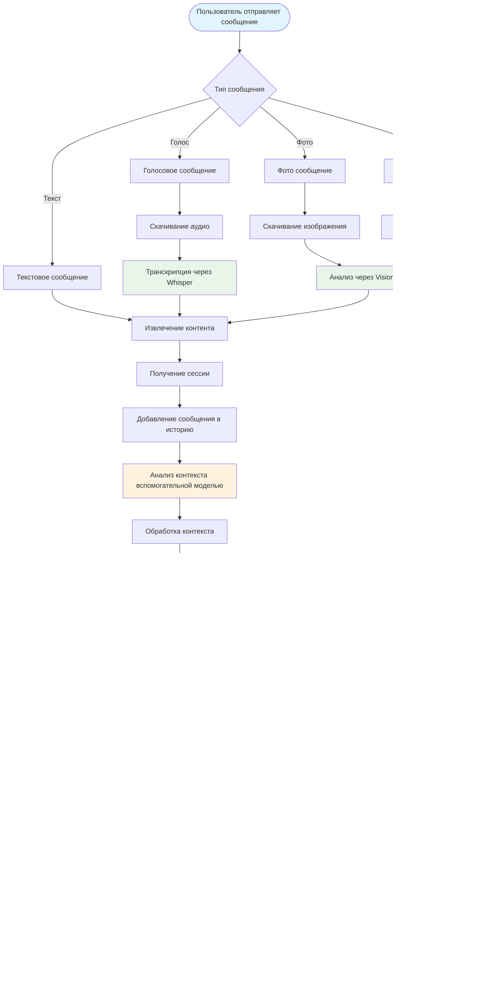

# Архитектурная диаграмма Easy Lessons Bot

## Общая архитектура системы


## Детальная схема потока данных



## Схема компонентов и их взаимодействий


## Схема данных и состояний


## Схема конфигурации и зависимостей


## Схема обработки ошибок и graceful degradation


## Схема логирования и мониторинга

```mermaid
graph LR
    subgraph "Application Components"
        A[Bot Handlers]
        B[Message Processor]
        C[LLM Client]
        D[Session Manager]
        E[Media Processor]
        F[Database Manager]
    end
    
    subgraph "Logging System"
        G[Python Logging]
        H[Log Formatter]
        I[File Handler]
    end
    
    subgraph "Log Output"
        J[/log/app.log]
        K[Console Output]
    end
    
    subgraph "Log Content"
        L[User Messages]
        M[LLM Requests/Responses]
        N[Database Operations]
        O[Media Processing]
        P[Errors & Exceptions]
        Q[Performance Metrics]
    end
    
    A --> G
    B --> G
    C --> G
    D --> G
    E --> G
    F --> G
    
    G --> H
    H --> I
    I --> J
    I --> K
    
    J --> L
    J --> M
    J --> N
    J --> O
    J --> P
    J --> Q
    
    style G fill:#e8f5e8
    style J fill:#f3e5f5
    style P fill:#ffebee
    style Q fill:#fff3e0
```

Эта архитектурная диаграмма показывает полную структуру Easy Lessons Bot, включая все компоненты, их взаимодействия, потоки данных, обработку ошибок и системы логирования.
