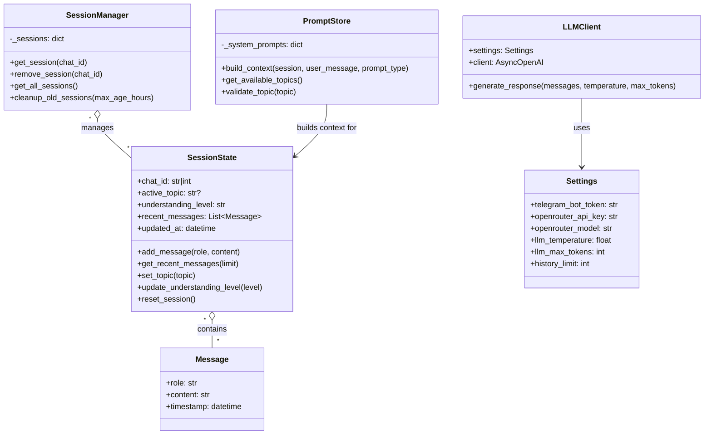

# Модель данных Easy Lessons Bot

## Обзор

Данный документ описывает структуру данных и классы, используемые в проекте Easy Lessons Bot.

## Основные классы

### SessionState
Управляет состоянием пользовательской сессии в памяти.

```python
class SessionState:
    chat_id: str | int                    # Идентификатор чата Telegram
    active_topic: str | None              # Текущая активная тема
    understanding_level: str              # Уровень понимания: "low", "medium", "high"
    recent_messages: list[Message]        # История сообщений (лимит 30)
    updated_at: datetime                  # Время последнего обновления
```

**Методы:**
- `add_message(role: str, content: str)` - добавить сообщение в историю
- `get_recent_messages(limit: int = 30)` - получить последние сообщения
- `set_topic(topic: str)` - установить активную тему
- `update_understanding_level(level: str)` - обновить уровень понимания
- `reset_session()` - сбросить состояние сессии

### Message
Представляет одно сообщение в истории диалога.

```python
class Message:
    role: str                             # Роль: "user" или "bot"
    content: str                          # Содержимое сообщения
    timestamp: datetime                   # Время создания сообщения
```

### SessionManager
Управляет всеми активными сессиями в памяти.

```python
class SessionManager:
    _sessions: dict[str | int, SessionState]  # Словарь активных сессий
```

**Методы:**
- `get_session(chat_id: str | int)` - получить или создать сессию
- `remove_session(chat_id: str | int)` - удалить сессию
- `get_all_sessions()` - получить все активные сессии
- `cleanup_old_sessions(max_age_hours: int = 24)` - очистить старые сессии

### LLMClient
Клиент для взаимодействия с OpenRouter API.

```python
class LLMClient:
    settings: Settings                    # Настройки приложения
    client: AsyncOpenAI                   # OpenAI клиент с base_url OpenRouter
```

**Методы:**
- `generate_response(messages, temperature, max_tokens)` - генерация ответа от LLM

### PromptStore
Управляет системными промптами и сборкой контекста.

```python
class PromptStore:
    _system_prompts: dict[str, str]       # Загруженные системные промпты
```

**Методы:**
- `build_context(session, user_message, prompt_type)` - сборка контекста для LLM
- `get_available_topics()` - получить список доступных тем
- `validate_topic(topic: str)` - валидация темы

### Settings
Конфигурация приложения через pydantic-settings.

```python
class Settings:
    telegram_bot_token: str               # Токен Telegram бота
    openrouter_api_key: str               # API ключ OpenRouter
    openrouter_model: str = "gpt-4o-mini" # Модель LLM
    llm_temperature: float = 0.9          # Температура LLM
    llm_max_tokens: int = 6000            # Максимум токенов в ответе
    history_limit: int = 30               # Лимит истории сообщений
```

## Диаграмма классов



## Поток данных

1. **Входящее сообщение** → `SessionManager.get_session()` → `SessionState`
2. **Сбор контекста** → `PromptStore.build_context()` → список сообщений для LLM
3. **Генерация ответа** → `LLMClient.generate_response()` → текст ответа
4. **Обновление состояния** → `SessionState.add_message()` → сохранение в историю

## Особенности реализации

- **In-memory хранение**: все данные хранятся в памяти, без БД
- **Singleton паттерн**: глобальные экземпляры для `SessionManager`, `LLMClient`, `PromptStore`
- **Типизация**: строгая типизация всех публичных методов
- **Логирование**: все операции логируются с соответствующими уровнями
- **Очистка**: автоматическая очистка старых сессий для управления памятью
