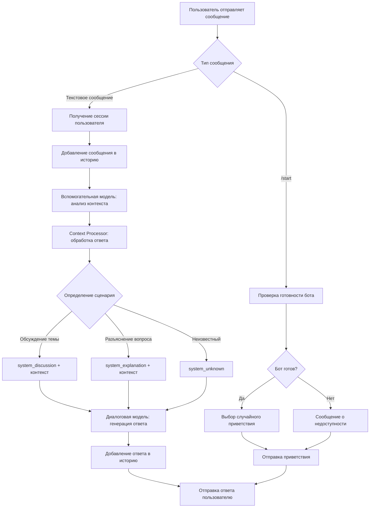
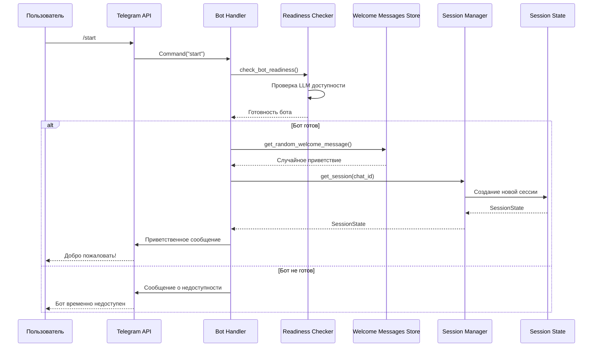
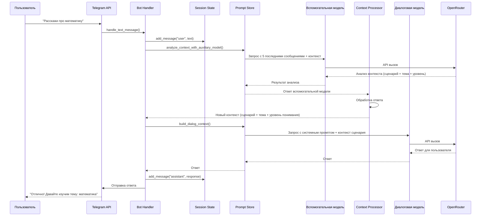
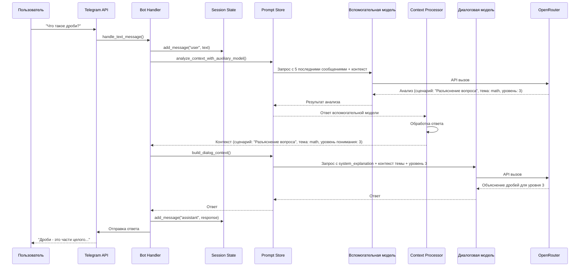
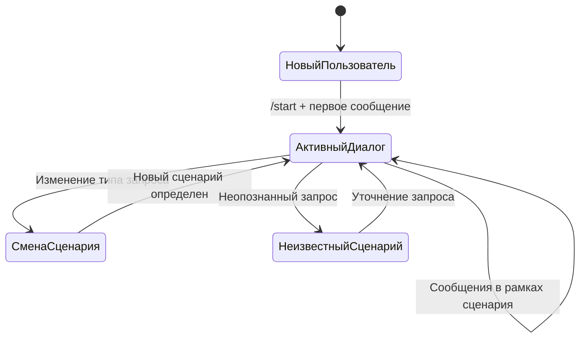
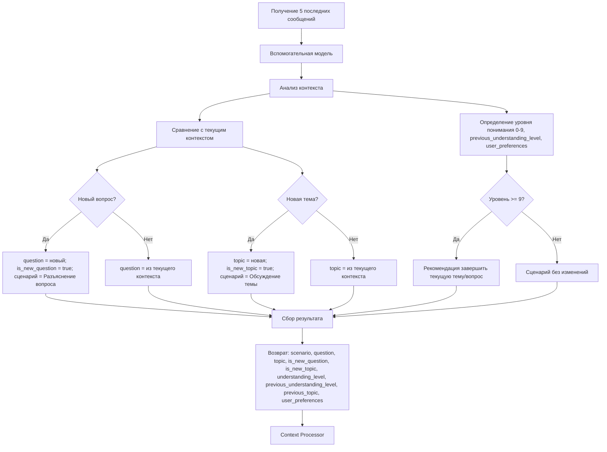
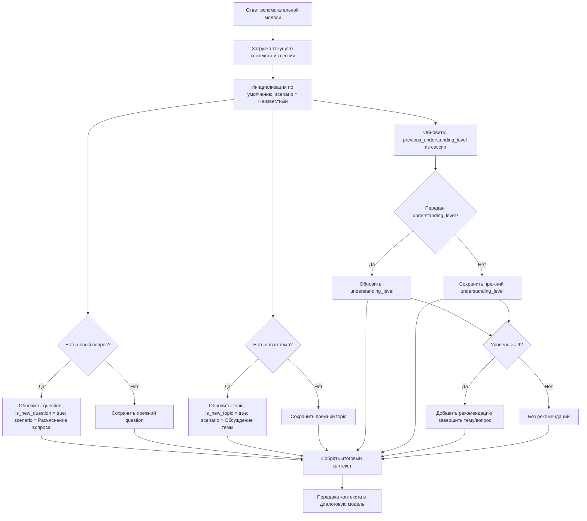

# Схема диалога Easy Lessons Bot

## Содержание
- [Обзор системы](#обзор-системы)
- [Архитектура диалоговой системы](#архитектура-диалоговой-системы)
- [Поток обработки сообщения](#поток-обработки-сообщения)
- [Детальная схема диалога](#детальная-схема-диалога)
- [Состояния диалога](#состояния-диалога)
- [Промпты](#промпты)
- [Динамический контекст](#динамический-контекст)
- [Логика принятия решений](#логика-принятия-решений)
- [Сценарии работы бота](#сценарии-работы-бота)
- [Темы для изучения](#темы-для-изучения)
- [Обработка ошибок](#обработка-ошибок)
- [Формирование запроса к модели](#формирование-запроса-к-модели)
- [Особенности реализации](#особенности-реализации)

## Обзор системы

Easy Lessons Bot - это образовательный Telegram-бот для детей 7-11 лет, который помогает изучать различные темы простым и понятным языком. **Важно: в системе НЕТ фиксированного списка тем** - бот может работать с любой темой, которую предложит пользователь.

Бот использует **две языковые модели**:

1. **Диалоговая модель** - непосредственно ведет диалог с пользователем
2. **Вспомогательная модель** - анализирует контекст и определяет параметры для диалоговой модели

Система использует **9-бальную шкалу понимания** (0-9) для адаптации под уровень пользователя.

## Архитектура диалоговой системы

### Основные компоненты

1. **Telegram Bot Handler** (`bot/handlers.py`) - обработка входящих сообщений
2. **Session Manager** (`core/session_state.py`) - управление состоянием пользователей
3. **Prompt Store** (`core/prompt_store.py`) - управление промптами и контекстом
4. **LLM Client** (`core/llm_client.py`) - взаимодействие с языковыми моделями
5. **Context Processor** - обработка ответов вспомогательной модели
6. **Readiness Checker** - проверка готовности бота к работе
7. **Welcome Messages Store** - хранение разнообразных приветственных сообщений

### Поток обработки сообщения



## Детальная схема диалога

### 1. Инициализация диалога



### 2. Обработка текстового сообщения



### 3. Продолжение диалога по теме



## Состояния диалога

### SessionState



 

## Промпты
Где хранятся:
- Базовый системный промпт: `core/prompts/system_base.txt` (или аналогичный путь в хранилище промптов).
- Промпты сценариев: `core/prompts/scenarios/system_<scenario_id>.txt`, где `<scenario_id>` — латинский идентификатор (`discussion`, `explanation`, `unknown`).

Как формируются:
- Модуль Prompt Store загружает базовый промпт и промпт сценария по `scenario_id`.
- Динамический контекст сериализуется в краткий текстовый блок (ключ:значение/маркированный список) и вставляется между базовым промптом и промптом сценария.
- Итоговый системный промпт = базовый + динамический контекст + промпт сценария. Он всегда находится первым сообщением и не обрезается.

Какой модуль отвечает:
- `core/prompt_store.py` (Prompt Store):
  - загрузка и кэширование файлов промптов;
  - сборка системного промпта из частей;
  - предоставление API для формирования payload для модели.

### Формирование системного промпта
Текстом: системный промпт формируется как конкатенация трёх частей — базовый системный промпт, динамический контекст и системный промпт сценария (по id). Он закрепляется вверху истории и не обрезается при усечении диалога.

## Логика принятия решений

### Работа вспомогательной модели



### Context Processor



### Формирование системного промпта

Текстом: системный промпт формируется как конкатенация трех частей — базовый системный промпт, динамический контекст и системный промпт сценария (по id). Он всегда закрепляется вверху истории и не обрезается при усечении диалога.

### Проверка готовности бота

Текстом: проверка выполняется при `/start` и периодически по расписанию. Цели:
- убедиться в доступности LLM/провайдера,
- проверить сетевые зависимости и доступ к хранилищам,
- валидировать ключевые конфигурации (ключи, лимиты, версии промптов).

Если компонент недоступен, бот сообщает пользователю о временной недоступности и логирует проблему для обслуживания.

### Выбор приветственного сообщения

Текстом: поддерживаем набор эквивалентных приветствий разного стиля (тон/формулировка) и при каждом `/start` случайно выбираем одно. Это делает первые впечатления разнообразнее и дружелюбнее.

## Обработка ошибок

### Типы ошибок и реакции

1. **Ошибка LLM** → Сообщение об ошибке + предложение переформулировать
2. **Неопределенный сценарий** → Переход к сценарию "Неизвестный"
3. **Неопределенная тема** → Сценарий "Неизвестный" + предложение уточнить запрос
4. **Сетевые ошибки** → Повторная попытка + fallback сообщение
5. **Таймаут** → Уведомление о задержке + предложение повторить
6. **Бот не готов** → Сообщение о недоступности + контакты поддержки
7. **Ошибка проверки готовности** → Fallback сообщение + логирование

## Формирование запроса к модели

Диалог для отправки в модель формируется на основе структуры сессии. Используем собранный системный промпт (базовый системный промпт + динамический контекст + системный промпт сценария), историю и текущее сообщение пользователя.

### Из структуры сессии → в payload
- Берём `system_prompt_base`, `dynamic_context` и `scenario_system_prompt` и формируем единый системный промпт (он всегда первый и не обрезается).
- Добавляем историю `messages` (пары user/assistant) в пределах токен-бюджета.
- Добавляем текущее сообщение пользователя.
- При усечении истории удаляем самые ранние пары user/assistant; системный промпт и текущее сообщение пользователя остаются.

### Пример сформированного запроса
```json
{
  "model": "gpt-4o-mini",
  "messages": [
    {
      "role": "system",
      "content": "Ты — доброжелательный учитель для детей 7–11 лет. Объясняй просто, короткими фразами, с примерами из жизни. Избегай сложных терминов, используй сравнения и наглядные образы.\n\nКонтекст:\n- Сценарий: Обсуждение темы\n- Тема: Дроби\n- Вопрос: null\n- Новый вопрос: false\n- Новая тема: true\n- Уровень: 3 (был 2)\n- Предыдущие подтемы: Натуральные числа\n- Предпочтения: примеры, мини-игры\n\nИнструкции сценария:\nИзлагай материал по шагам, задавай короткие проверочные вопросы, предлагай мини-игры для закрепления."
    },
    {"role": "user", "content": "Привет!"},
    {"role": "assistant", "content": "Привет! О чем поговорим?"},
    {"role": "user", "content": "Не понимаю дроби, расскажи."}
  ],
  "temperature": 0.3,
  "max_tokens": 512
}
```

## Динамический контекст

Динамический контекст формируется вспомогательной моделью и передается диалоговой модели. Это ключ-значение данные, которые всегда включаются в запрос к диалоговой модели. Контекст передается всегда.

### Поля динамического контекста
- scenario: строка (идентификатор латиницей). Сценарий работы. По умолчанию — `unknown`.
- question: строка или null. Текущий обсуждаемый вопрос.
- topic: строка или null. Текущая обсуждаемая тема.
- is_new_question: boolean. Флаг нового вопроса.
- is_new_topic: boolean. Флаг новой темы.
- understanding_level: integer [0..9]. Текущий уровень понимания темы/вопроса.
- previous_understanding_level: integer [0..9] или null. Предыдущий уровень понимания для сравнения динамики. Включается только если отличается от текущего.
- previous_topic: string или null. Последняя обсуждаемая тема до текущей. Включается только если отличается от текущей `topic`.
- user_preferences: string[]. Предпочтения формата ответа (примеры, мини-игры, пошаговость и т.д.).

### Правила определения контекста
- Вопрос: если пользователь задает вопрос, который выходит за рамки текущей темы и текущего вопроса, либо текущий сценарий — Неизвестный, то
  - устанавливаем question на новый вопрос,
  - is_new_question = true,
  - scenario = Разъяснение вопроса.
  Иначе сохраняем существующие значения из контекста.

- Тема: если пользователь предлагает обсудить тему или сообщает, что тема непонятна и хочет её обсудить, и при этом тема выходит за рамки текущей темы или текущего вопроса, либо текущий сценарий — Неизвестный, то
  - устанавливаем topic на новую тему,
  - is_new_topic = true,
  - scenario = Обсуждение темы.
  Иначе сохраняем существующие значения из контекста.

- Сценарий: по умолчанию — Неизвестный. Условия переключения описаны выше. Дополнительно, если understanding_level >= 9 по текущей теме или вопросу, диалоговая модель должна предложить завершить тему/вопрос и перейти к другой теме или свободному общению. Если пользователь явно говорит «давай поболтаем», переключаемся в сценарий Неизвестный.

### Пример динамического контекста
```json
{
  "scenario": "discussion",
  "question": null,
  "topic": "Дроби",
  "is_new_question": false,
  "is_new_topic": true,
  "understanding_level": 3,
  "previous_understanding_level": 2,
  "previous_topic": "Натуральные числа",
  "user_preferences": ["примеры", "мини-игры"]
}
```

### Назначение дополнительных полей
- previous_understanding_level: хранит прошлый уровень понимания. Если текущий уровень выше — диалоговая модель может похвалить; если ниже или без изменений — подбодрить и предложить другой подход (пример, визуализация, мини-игру). Поле включается только при отличии от текущего уровня.
- previous_topic: последняя подтема до текущей; помогает ссылаться на уже разобранное и избегать повторов. Поле включается только если отличается от текущей `topic`.
- user_preferences: подстраивает формат ответа (больше примеров, игры, пошаговость и т.п.). Не влияет на выбор сценария, но улучшает подачу.

## Темы для изучения

**ВАЖНО: В системе НЕТ фиксированного списка тем.** Бот может работать с любой темой, которую предложит пользователь. Вспомогательная модель определяет тему на основе контекста диалога и может адаптироваться к любым образовательным потребностям ребенка.

### Примеры тем (НЕ ограничивающий список):
- **Дроби** — части целого, сравнение дробей, сложение и вычитание дробей
- **Задачи на скорость** — путь, время, скорость; относительная скорость
- **Умножение столбиком** — пошаговый разбор и тренировка
- **Табличное умножение на 7** — приемы запоминания и практика
- **Орфограмма ЖИ–ШИ** — правило и тренировка на примерах
- **Фазы Луны** — почему меняется вид Луны
- **Строение клетки** — основные органоиды и их функции
- **Единицы длины** — мм, см, м, км и переводы между ними
- **Правила переноса слов** — базовые примеры и исключения
- **Безопасность в интернете** — личные данные, пароли, фишинг

Темы могут быть как узкими (например, «Дроби», «Задачи на скорость»), так и широкими, в зависимости от запроса ребенка.

## Сценарии работы бота

Бот может работать в нескольких сценариях, каждый из которых имеет свой системный промпт:

### 1. Сценарий "Обсуждение темы" (id: `discussion`)
- **Назначение**: Общее обсуждение и изучение темы
- **Системный промпт**: `system_discussion` (имя файла промпта совпадает с идентификатором сценария латиницей)
- **Контекст**: тема + уровень понимания (0-9)
- **Примеры**: "Расскажи про математику", "Что такое дроби?", "Как работает электричество?"

### 2. Сценарий "Разъяснение вопроса" (id: `explanation`)
- **Назначение**: Детальное разъяснение конкретного вопроса или понятия
- **Системный промпт**: `system_explanation` (идентификатор латиницей используется в имени файла)
- **Контекст**: тема + уровень понимания (0-9)
- **Примеры**: "Почему небо голубое?", "Как работает фотосинтез?", "Что такое гравитация?"

### 3. Сценарий "Неизвестный" (id: `unknown`)
- **Назначение**: Обработка неопознанных запросов
- **Системный промпт**: `system_unknown` (идентификатор латиницей используется в имени файла)
- **Контекст**: базовые принципы работы бота
- **Примеры**: Неясные сообщения, запросы вне образовательного контекста

### Формирование контекста

Контекст формируется как словарь ключ-значение и всегда добавляется в диалоговую модель. Контекст не может быть пустым: по умолчанию он всегда содержит сценарий "Неизвестный":

```json
{
  "scenario": "Обсуждение темы",
  "topic": "Дроби",
  "understanding_level": 3,
  "previous_understanding_level": 2,
  "previous_topic": "Натуральные числа",
  "user_preferences": ["примеры", "мини-игры"]
}
```

## Особенности реализации

### Двухмодельная архитектура
- **Вспомогательная модель**: анализирует контекст, определяет сценарий работы, тему и уровень понимания
- **Диалоговая модель**: генерирует ответы на основе обработанного контекста и выбранного сценария
- Разделение ответственности для более точной работы

### 9-бальная шкала понимания
- **0-2**: Начальный уровень - простые объяснения, много примеров
- **3-4**: Базовое понимание - структурированные объяснения
- **5-6**: Хорошее понимание - детальные объяснения с нюансами
- **7-8**: Продвинутый уровень - сложные концепции и связи
- **9**: Экспертный уровень - глубокие дискуссии и анализ

### In-memory хранение
- Все сессии хранятся в памяти
- Автоматическая очистка старых сессий (24 часа)
- Нет персистентного хранения

### Адаптивность
- Динамическое определение сценария работы через вспомогательную модель
- Динамическое определение темы через вспомогательную модель (БЕЗ фиксированного списка тем)
- Точная адаптация под уровень понимания (0-9)
- Контекстная генерация ответов на основе выбранного сценария
- Разнообразные приветственные сообщения

### Надежность
- Проверка готовности перед началом работы
- Обработка ошибок на всех уровнях
- Fallback промпты для обеих моделей
- Логирование всех операций
- Graceful degradation при недоступности LLM

### Структура файлов

```
core/
├── prompts/           # Системные промпты
├── welcome_messages/  # Приветственные сообщения
│   ├── welcome_01.txt
│   ├── welcome_02.txt
│   └── ...
└── readiness/         # Проверка готовности
    └── checker.py
```
