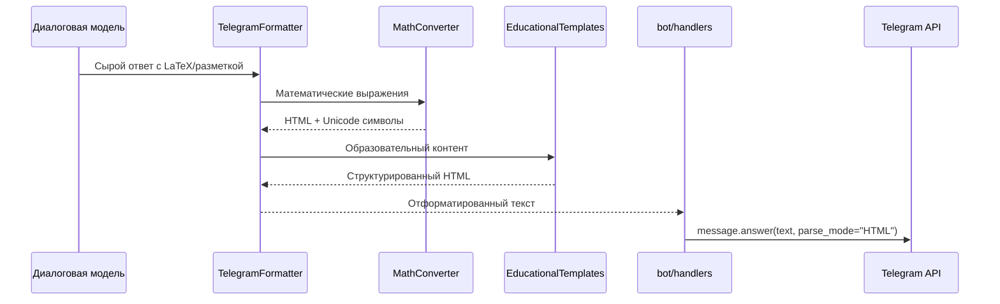

## Система форматирования сообщений для Telegram

### Обзор фичи
- **Цель**: Обеспечить корректное отображение образовательного контента в Telegram с поддержкой математических выражений и структурированного текста
- **Проблема**: Текущая система генерирует LaTeX-подобные выражения `\( ... \)`, которые не поддерживаются Telegram Bot API
- **Решение**: Автоматическое преобразование контента в HTML-формат с использованием Unicode символов и структурной разметки

### Технические требования
- Поддержка Telegram Bot API форматирования: HTML parse_mode
- Преобразование LaTeX-подобных выражений в Unicode и HTML
- Структурирование образовательного контента с визуальными элементами
- Graceful degradation при ошибках форматирования
- Совместимость с существующей двухмодельной архитектурой

### Архитектура решения

#### Компоненты системы
- **`core/formatting/telegram_formatter.py`** — основной модуль форматирования
- **`core/formatting/math_converter.py`** — преобразование математических выражений
- **`core/formatting/educational_templates.py`** — шаблоны для образовательного контента
- **Обновления в `bot/handlers.py`** — интеграция форматирования в отправку сообщений
- **Обновления в промптах** — инструкции для LLM по использованию поддерживаемого форматирования

#### Поток обработки сообщений с форматированием


### Модуль форматирования

#### `core/formatting/telegram_formatter.py`
```python
"""Main Telegram message formatter for educational content."""

import re
from typing import Optional

from .math_converter import MathConverter
from .educational_templates import EducationalTemplates

class TelegramFormatter:
    """Format educational content for optimal Telegram display."""
    
    def __init__(self):
        self.math_converter = MathConverter()
        self.templates = EducationalTemplates()
    
    def format_message(self, text: str, content_type: str = "general") -> str:
        """
        Convert raw educational content to Telegram HTML format.
        
        Args:
            text: Raw text from LLM
            content_type: Type of content (math, science, language, general)
            
        Returns:
            HTML-formatted text ready for Telegram
        """
        # Convert LaTeX-like expressions
        text = self.math_converter.convert_math_expressions(text)
        
        # Apply educational formatting
        text = self.templates.apply_formatting(text, content_type)
        
        # Basic markdown to HTML conversion
        text = self._convert_markdown_to_html(text)
        
        return text
    
    def _convert_markdown_to_html(self, text: str) -> str:
        """Convert basic markdown syntax to HTML."""
        # Bold: **text** -> <b>text</b>
        text = re.sub(r'\*\*(.*?)\*\*', r'<b>\1</b>', text)
        
        # Italic: *text* -> <i>text</i>
        text = re.sub(r'\*(.*?)\*', r'<i>\1</i>', text)
        
        # Code: `text` -> <code>text</code>
        text = re.sub(r'`([^`]+)`', r'<code>\1</code>', text)
        
        return text
```

#### `core/formatting/math_converter.py`
```python
"""Convert mathematical expressions for Telegram display."""

import re
from typing import Dict

class MathConverter:
    """Handle mathematical expression conversion."""
    
    # Unicode mathematical symbols
    MATH_SYMBOLS = {
        'sqrt': '√',
        'infinity': '∞',
        'sum': '∑',
        'product': '∏',
        'integral': '∫',
        'partial': '∂',
        'delta': 'Δ',
        'pi': 'π',
        'alpha': 'α',
        'beta': 'β',
        'gamma': 'γ',
        'theta': 'θ',
        'lambda': 'λ',
        'mu': 'μ',
        'sigma': 'σ',
        'phi': 'φ',
        'plus_minus': '±',
        'times': '×',
        'divide': '÷',
        'not_equal': '≠',
        'less_equal': '≤',
        'greater_equal': '≥',
        'approximately': '≈',
    }
    
    # Superscript digits for powers
    SUPERSCRIPTS = str.maketrans('0123456789', '⁰¹²³⁴⁵⁶⁷⁸⁹')
    
    def convert_math_expressions(self, text: str) -> str:
        """Convert LaTeX-like math to Unicode and HTML."""
        # Convert \( ... \) to <code>...</code>
        text = re.sub(r'\\\(([^)]+)\\\)', r'<code>\1</code>', text)
        
        # Convert powers: x^2 -> x²
        text = re.sub(r'(\w+)\^(\d+)', self._convert_power, text)
        
        # Convert square roots: sqrt(x) -> √x
        text = re.sub(r'sqrt\(([^)]+)\)', r'√\1', text)
        
        # Convert common mathematical symbols
        for symbol, unicode_char in self.MATH_SYMBOLS.items():
            text = text.replace(f'\\{symbol}', unicode_char)
        
        return text
    
    def _convert_power(self, match) -> str:
        """Convert power notation to superscript."""
        base = match.group(1)
        power = match.group(2)
        superscript_power = power.translate(self.SUPERSCRIPTS)
        return f"{base}{superscript_power}"
```

#### `core/formatting/educational_templates.py`
```python
"""Educational content formatting templates."""

import re
from typing import Dict

class EducationalTemplates:
    """Apply educational formatting patterns."""
    
    SUBJECT_EMOJIS = {
        'math': '📐',
        'science': '🔬', 
        'physics': '⚡',
        'chemistry': '⚗️',
        'biology': '🧬',
        'language': '📚',
        'history': '📜',
        'geography': '🌍',
        'general': '💡'
    }
    
    def apply_formatting(self, text: str, content_type: str) -> str:
        """Apply educational formatting patterns."""
        # Add subject emoji
        emoji = self.SUBJECT_EMOJIS.get(content_type, '💡')
        
        # Format common educational patterns
        text = self._format_examples(text)
        text = self._format_steps(text)
        text = self._format_results(text)
        text = self._format_definitions(text)
        
        return text
    
    def _format_examples(self, text: str) -> str:
        """Format example sections."""
        patterns = [
            (r'Например:', r'<b>📝 Например:</b>'),
            (r'Пример:', r'<b>📝 Пример:</b>'),
            (r'Например,', r'<b>📝 Например,</b>'),
        ]
        
        for pattern, replacement in patterns:
            text = re.sub(pattern, replacement, text, flags=re.IGNORECASE)
        
        return text
    
    def _format_steps(self, text: str) -> str:
        """Format step-by-step solutions."""
        patterns = [
            (r'Решение:', r'<b>🔍 Решение:</b>'),
            (r'Шаги:', r'<b>📋 Шаги:</b>'),
            (r'Алгоритм:', r'<b>⚙️ Алгоритм:</b>'),
        ]
        
        for pattern, replacement in patterns:
            text = re.sub(pattern, replacement, text, flags=re.IGNORECASE)
        
        # Format numbered lists
        text = re.sub(r'^(\d+)\.', r'• <b>\1.</b>', text, flags=re.MULTILINE)
        text = re.sub(r'^- ', r'• ', text, flags=re.MULTILINE)
        
        return text
    
    def _format_results(self, text: str) -> str:
        """Format answers and results."""
        patterns = [
            (r'Ответ:', r'<b>✅ Ответ:</b>'),
            (r'Результат:', r'<b>✅ Результат:</b>'),
            (r'Итог:', r'<b>✅ Итог:</b>'),
        ]
        
        for pattern, replacement in patterns:
            text = re.sub(pattern, replacement, text, flags=re.IGNORECASE)
        
        return text
    
    def _format_definitions(self, text: str) -> str:
        """Format definitions and important terms."""
        patterns = [
            (r'Определение:', r'<b>📖 Определение:</b>'),
            (r'Правило:', r'<b>📏 Правило:</b>'),
            (r'Формула:', r'<b>🧮 Формула:</b>'),
        ]
        
        for pattern, replacement in patterns:
            text = re.sub(pattern, replacement, text, flags=re.IGNORECASE)
        
        return text
```

### Интеграция в обработчики

#### Обновления в `bot/handlers.py`
```python
from core.formatting.telegram_formatter import TelegramFormatter

# Initialize formatter
telegram_formatter = TelegramFormatter()

@router.message(lambda message: message.text is not None)
async def handle_text_message(message: Message) -> None:
    """Handle text messages from users."""
    chat_id = message.chat.id
    user_text = message.text or ""

    logger.info("💬 Received text message from user %s: %s", chat_id, user_text[:50])

    # Use unified message processor
    processor = get_unified_processor()
    response_text = await processor.process_message(message, "text")
    
    if response_text:
        # Apply Telegram formatting
        formatted_text = telegram_formatter.format_message(response_text)
        
        try:
            await message.answer(formatted_text, parse_mode="HTML")
            logger.info("Sent formatted LLM response to user %s", chat_id)
        except Exception as e:
            # Fallback to plain text if HTML parsing fails
            logger.warning("HTML formatting failed, sending plain text: %s", e)
            await message.answer(response_text)
    else:
        await message.answer("Извините, произошла ошибка при обработке сообщения.")
```

### Обновления системных промптов

#### Добавления в `core/prompts/system_base.txt`
```text
Formatting Guidelines for Mathematical Content:
- Use simple mathematical notation that will be converted to Unicode
- For powers, use the ^ symbol: x^2, a^3
- For square roots, use sqrt(): sqrt(25), sqrt(x+1)
- Wrap complex formulas in backticks for code formatting: `a^2 + b^2 = c^2`
- Use clear section headers: "Пример:", "Решение:", "Ответ:"
- Structure content with bullet points and numbered lists
- Use bold text for important terms: **определение**, **правило**

Educational Content Structure:
- Start with brief explanation
- Provide clear examples with step-by-step solutions
- End with summary or answer
- Use visual elements like emojis sparingly for structure
- Break complex topics into digestible parts
```

### Примеры форматирования

#### Математическая задача
**Исходный текст от LLM:**
```
**Теорема Пифагора**

Формула выглядит так: \( a^2 + b^2 = c^2 \), где a и b — это длины катетов, а c — длина гипотенузы.

Например, если один катет равен 3, а другой 4, то мы можем посчитать так:
- \( 3^2 = 9 \)
- \( 4^2 = 16 \)
- Теперь сложим: \( 9 + 16 = 25 \)
- И найдем гипотенузу: \( c = sqrt(25) = 5 \)

Ответ: гипотенуза равна 5
```

**Отформатированный результат:**
```html
<b>📐 Теорема Пифагора</b>

<b>🧮 Формула:</b> <code>a² + b² = c²</code>, где a и b — это длины катетов, а c — длина гипотенузы.

<b>📝 Например,</b> если один катет равен 3, а другой 4, то мы можем посчитать так:
• <code>3² = 9</code>
• <code>4² = 16</code>
• Теперь сложим: <code>9 + 16 = 25</code>
• И найдем гипотенузу: <code>c = √25 = 5</code>

<b>✅ Ответ:</b> гипотенуза равна 5
```

### Тестирование

#### Unit тесты для форматтера
```python
# tests/test_telegram_formatter.py

import pytest
from core.formatting.telegram_formatter import TelegramFormatter

class TestTelegramFormatter:
    def setUp(self):
        self.formatter = TelegramFormatter()
    
    def test_latex_conversion(self):
        """Test LaTeX expression conversion."""
        input_text = r"Формула: \( a^2 + b^2 = c^2 \)"
        expected = "Формула: <code>a² + b² = c²</code>"
        result = self.formatter.format_message(input_text, "math")
        assert expected in result
    
    def test_power_conversion(self):
        """Test power notation conversion."""
        input_text = "x^2 + y^3 = z^10"
        expected = "x² + y³ = z¹⁰"
        result = self.formatter.format_message(input_text, "math")
        assert expected in result
    
    def test_educational_formatting(self):
        """Test educational pattern formatting."""
        input_text = "Например: решение задачи. Ответ: 42"
        result = self.formatter.format_message(input_text, "math")
        assert "<b>📝 Например:</b>" in result
        assert "<b>✅ Ответ:</b>" in result
    
    def test_graceful_degradation(self):
        """Test handling of malformed input."""
        input_text = "Обычный текст без специального форматирования"
        result = self.formatter.format_message(input_text, "general")
        # Should not raise exceptions and return some reasonable output
        assert isinstance(result, str)
        assert len(result) > 0
```

### Мониторинг и логирование

#### Метрики форматирования
- Количество успешно отформатированных сообщений
- Количество fallback'ов на plain text
- Время обработки форматирования
- Типы контента, требующие форматирования

#### Логирование в `telegram_formatter.py`
```python
import logging

logger = logging.getLogger(__name__)

class TelegramFormatter:
    def format_message(self, text: str, content_type: str = "general") -> str:
        start_time = time.time()
        
        try:
            formatted_text = self._apply_formatting(text, content_type)
            
            duration_ms = (time.time() - start_time) * 1000
            logger.info(
                "Formatted message: type=%s, input_length=%d, output_length=%d, duration_ms=%.2f",
                content_type, len(text), len(formatted_text), duration_ms
            )
            
            return formatted_text
            
        except Exception as e:
            logger.error("Formatting failed: %s, falling back to plain text", e)
            return text  # Graceful degradation
```

### Конфигурация

#### Добавления в `settings/config.py`
```python
class Settings(BaseSettings):
    # ... existing settings ...
    
    # Message formatting settings
    ENABLE_HTML_FORMATTING: bool = True
    FORMATTING_FALLBACK_TO_PLAIN: bool = True
    MAX_FORMATTING_TIME_MS: int = 100
    
    # Educational formatting preferences
    USE_MATHEMATICAL_UNICODE: bool = True
    USE_EDUCATIONAL_EMOJIS: bool = True
    DEFAULT_CONTENT_TYPE: str = "general"
```

### Развертывание

#### Изменения в дереве проекта
```
easy-lessons-bot/
├── core/
│   ├── formatting/
│   │   ├── __init__.py
│   │   ├── telegram_formatter.py
│   │   ├── math_converter.py
│   │   └── educational_templates.py
│   ├── prompts/
│   │   ├── system_base.txt (updated)
│   │   └── scenarios/ (updated)
├── tests/
│   ├── test_telegram_formatter.py
│   ├── test_math_converter.py
│   └── test_educational_templates.py
└── doc/
    └── message_formatting.md
```

### Обратная совместимость
- Форматирование применяется только к новым сообщениям
- При ошибках форматирования происходит graceful degradation к plain text
- Существующие обработчики команд сохраняют работоспособность
- Настройки форматирования опциональны с разумными значениями по умолчанию

### Планы развития
- **Поддержка MarkdownV2**: Альтернативный режим форматирования для продвинутых пользователей
- **Контекстное форматирование**: Адаптация стиля под возраст и уровень понимания пользователя
- **Интерактивные элементы**: Использование Inline клавиатур для интерактивных математических задач
- **Визуализация графиков**: Генерация простых математических графиков в виде ASCII-арт или изображений
- **Локализация**: Поддержка различных языков с соответствующими математическими обозначениями

