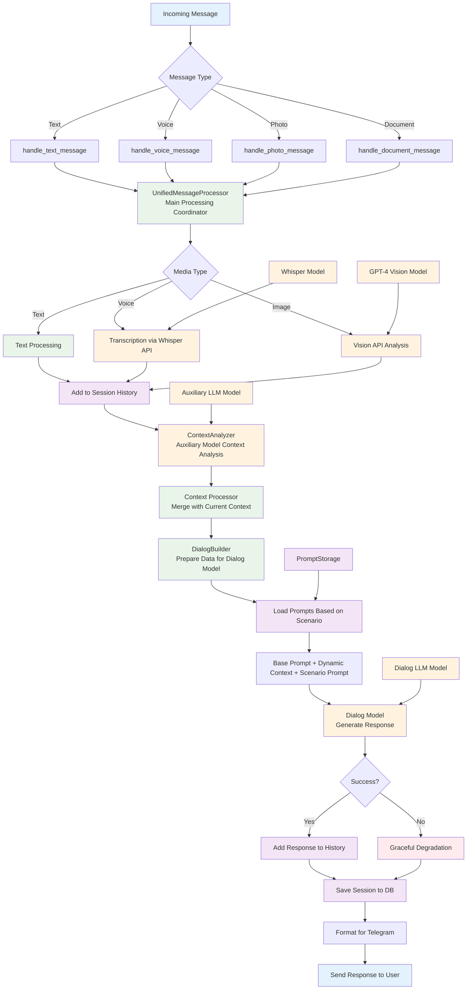
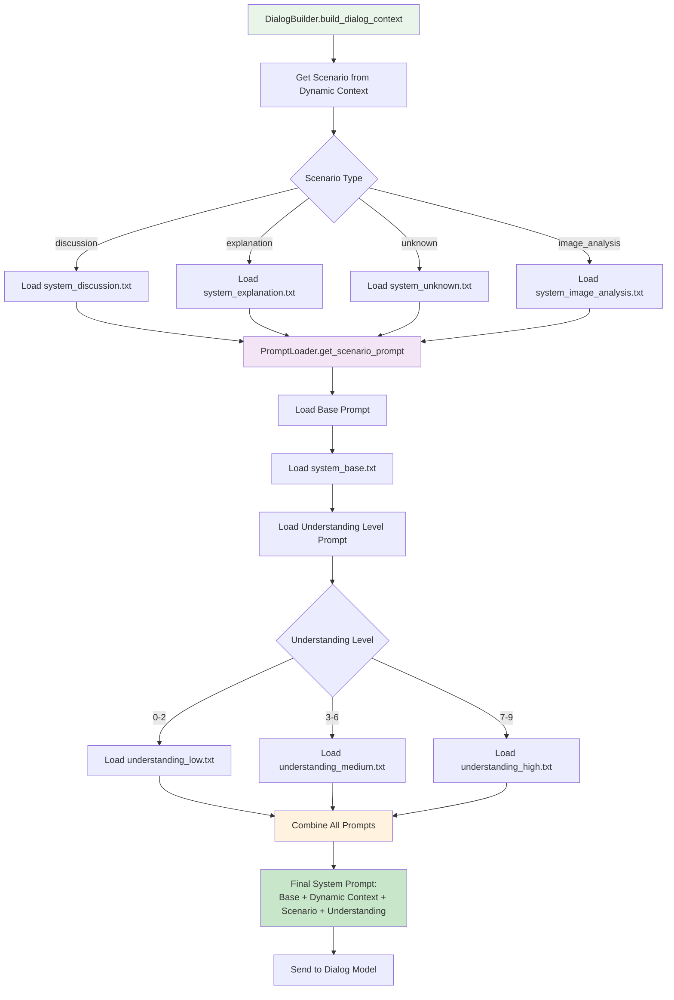
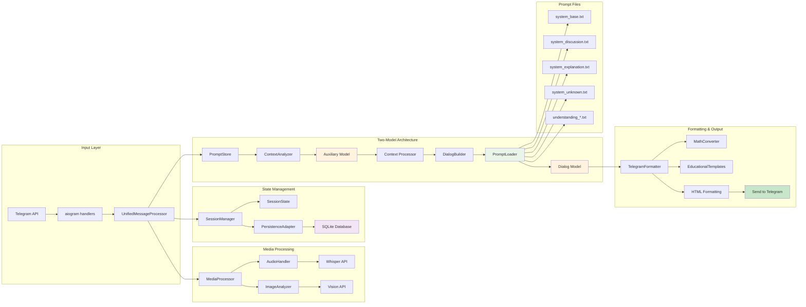
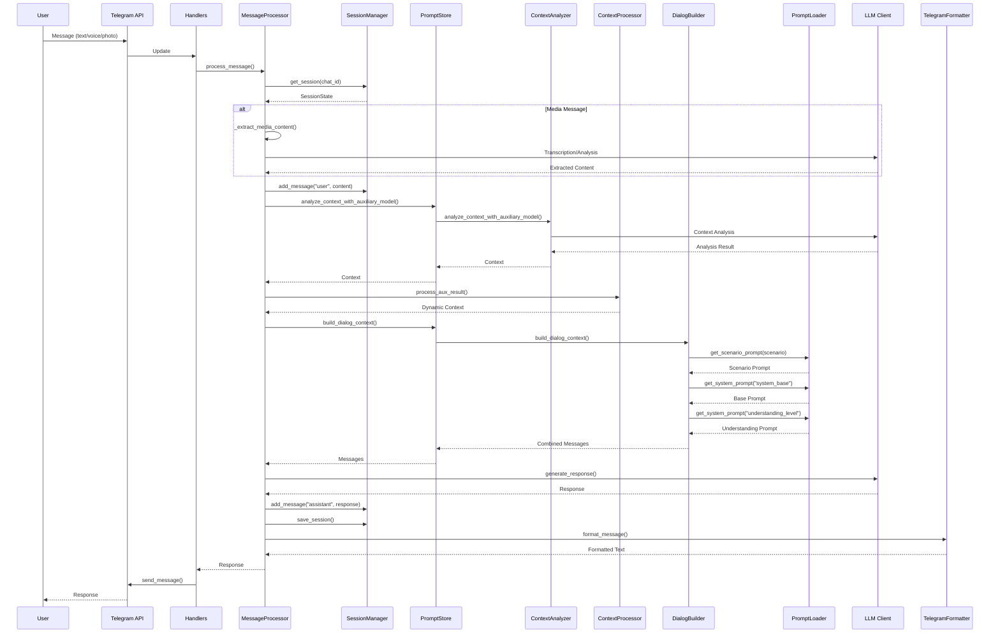

# Схема преобразования входящего сообщения в выходящее

## Обзор архитектуры

Easy Lessons Bot использует двухмодельную архитектуру для обработки сообщений:
1. **Вспомогательная модель** - анализирует контекст и определяет сценарий
2. **Диалоговая модель** - генерирует финальный ответ

## Диаграмма потока обработки сообщений



## Детальная схема загрузки промптов



## Детальная схема компонентов



## Последовательность обработки



## Ключевые компоненты

### 1. UnifiedMessageProcessor
- **Назначение**: Единая точка обработки всех типов сообщений
- **Функции**:
  - Извлечение контента из медиа-файлов
  - Координация двухмодельной архитектуры
  - Обработка ошибок и graceful degradation

### 2. SessionManager
- **Назначение**: Управление состоянием пользователей
- **Функции**:
  - Загрузка/сохранение сессий из SQLite
  - In-memory кеширование
  - Graceful degradation при недоступности БД

### 3. ContextAnalyzer
- **Назначение**: Анализ контекста вспомогательной моделью
- **Функции**:
  - Определение сценария (discussion/explanation/unknown)
  - Выявление темы и вопроса
  - Оценка уровня понимания (0-9)

### 4. ContextProcessor
- **Назначение**: Обработка результатов вспомогательной модели
- **Функции**:
  - Объединение с состоянием сессии
  - Определение новых тем/вопросов
  - Генерация рекомендаций

### 5. DialogBuilder
- **Назначение**: Построение контекста для диалоговой модели
- **Функции**:
  - Сборка системного промпта
  - Формирование истории диалога
  - Применение сценариев

### 6. PromptLoader
- **Назначение**: Загрузка промптов из файлов
- **Функции**:
  - Загрузка базовых промптов (`system_base.txt`)
  - Загрузка промптов сценариев (`system_discussion.txt`, `system_explanation.txt`, `system_unknown.txt`)
  - Загрузка промптов уровня понимания (`understanding_low.txt`, `understanding_medium.txt`, `understanding_high.txt`)
  - Кеширование загруженных промптов

### 7. TelegramFormatter
- **Назначение**: Форматирование ответов для Telegram
- **Функции**:
  - Конвертация математических выражений
  - Применение образовательных шаблонов
  - HTML форматирование

## Загрузка промптов по сценариям

### Момент загрузки:
Промпты загружаются в **DialogBuilder** на этапе подготовки данных для диалоговой модели, **после** определения сценария вспомогательной моделью.

### Структура промптов:
1. **Базовый промпт** (`system_base.txt`) - основные принципы работы
2. **Динамический контекст** - текущая тема, сценарий, уровень понимания
3. **Промпт сценария** - зависит от определенного сценария:
   - `system_discussion.txt` - для обсуждения темы
   - `system_explanation.txt` - для разъяснения вопроса
   - `system_unknown.txt` - для свободного общения
   - `system_image_analysis.txt` - для анализа изображений
4. **Промпт уровня понимания** - зависит от уровня (0-9):
   - `understanding_low.txt` - для уровней 0-2
   - `understanding_medium.txt` - для уровней 3-6
   - `understanding_high.txt` - для уровней 7-9

### Итоговый системный промпт:
```
[Базовый промпт]

[Динамический контекст]

[Промпт сценария]

[Промпт уровня понимания]
```

## Типы сообщений и их обработка

### Текстовые сообщения
1. Прямое использование текста
2. Анализ контекста вспомогательной моделью
3. Генерация ответа диалоговой моделью

### Голосовые сообщения
1. Скачивание аудио-файла из Telegram
2. Транскрипция через Whisper API
3. Анализ намерения из транскрипта
4. Передача в основной пайплайн как текст

### Изображения
1. Скачивание изображения из Telegram
2. Анализ через GPT-4 Vision API
3. Извлечение текста и определение типа контента
4. Генерация образовательного ответа

## Сценарии работы

### 1. Discussion (Обсуждение темы)
- **Триггер**: Новая тема или общее обсуждение
- **Поведение**: Объяснение темы с учетом уровня понимания
- **Промпт**: `system_discussion.txt`

### 2. Explanation (Разъяснение вопроса)
- **Триггер**: Конкретный вопрос
- **Поведение**: Детальное разъяснение с примерами
- **Промпт**: `system_explanation.txt`

### 3. Unknown (Неизвестный)
- **Триггер**: Свободное общение
- **Поведение**: Дружелюбная поддержка, наводки на учебные темы
- **Промпт**: `system_unknown.txt`

### 4. Image Analysis (Анализ изображений)
- **Триггер**: Отправка фото/изображения
- **Поведение**: Анализ контента и образовательный ответ
- **Промпт**: `system_image_analysis.txt`

## Обработка ошибок

### Graceful Degradation
- При недоступности LLM: использование предустановленных ответов
- При недоступности БД: работа в in-memory режиме
- При ошибках медиа-обработки: fallback на текстовый режим
- При ошибках загрузки промптов: использование встроенных fallback промптов

### Retry Logic
- 1 повтор для сетевых ошибок
- Экспоненциальная задержка (0.5s → 1.0s)
- Таймаут 30 секунд

## Персистентность данных

### SQLite Database
- **Sessions**: Состояние пользователей
- **Messages**: История диалогов
- **Migrations**: Версионирование схемы

### Graceful Degradation
- При недоступности БД: работа в памяти
- Автоматическое восстановление при доступности БД
- Миграции при старте приложения

## Конфигурация

### Переменные окружения
- `TELEGRAM_BOT_TOKEN`: Токен бота
- `OPENROUTER_API_KEY`: API ключ для LLM
- `OPENROUTER_MODEL`: Модель по умолчанию (gpt-4o-mini)
- `DATABASE_ENABLED`: Включение БД
- `AUDIO_ENABLED`: Включение обработки аудио
- `IMAGE_ANALYSIS_ENABLED`: Включение анализа изображений

### Настройки форматирования
- `ENABLE_HTML_FORMATTING`: HTML форматирование
- `USE_MATHEMATICAL_UNICODE`: Математические символы
- `USE_EDUCATIONAL_EMOJIS`: Образовательные эмодзи