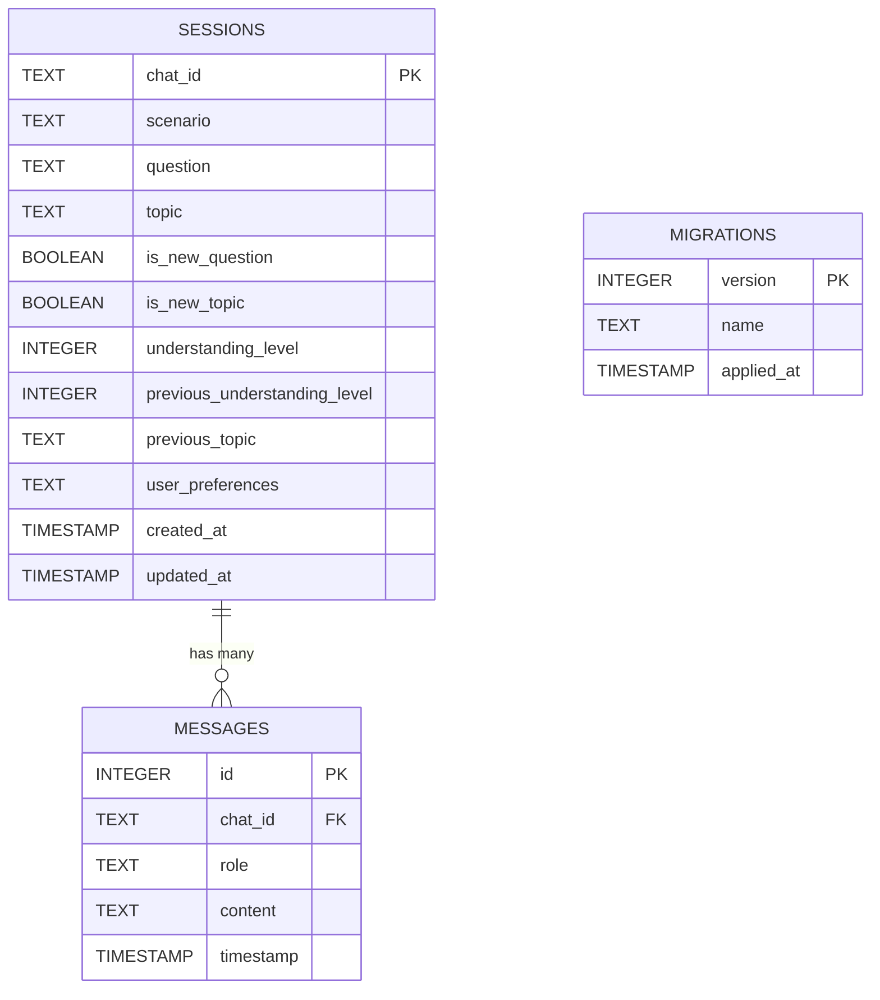
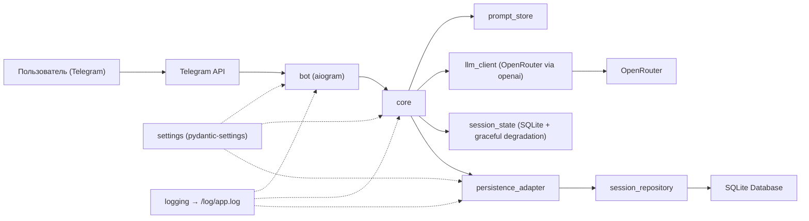
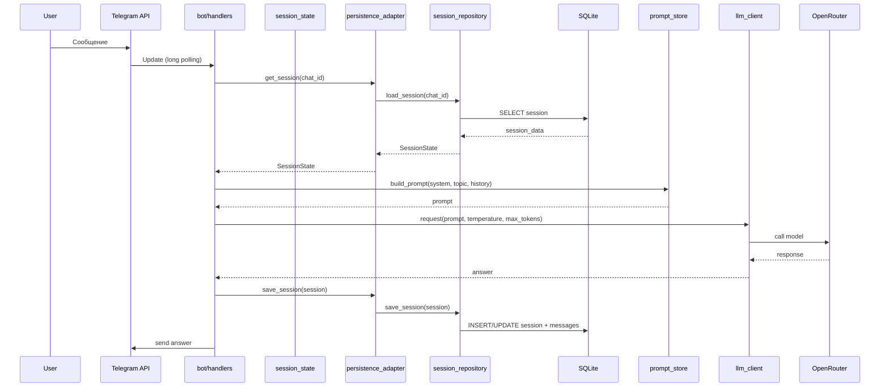
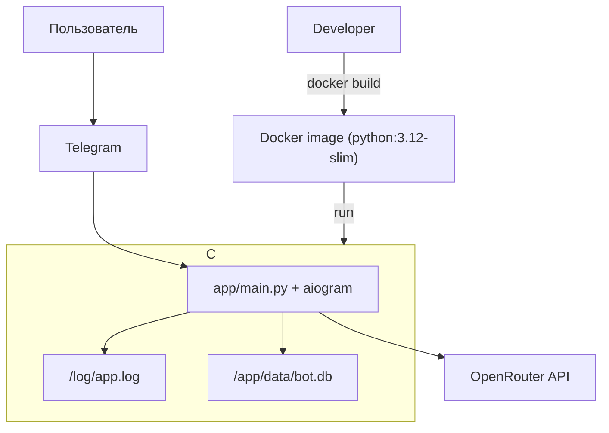

## Персистентность данных Easy Lessons Bot

### Технологии
- База данных: SQLite (встроенная, файловая)
- ORM: SQLAlchemy 2.0 (async/await)
- Миграции: собственная система миграций
- Хранение: файл `data/bot.db` в контейнере

### Принципы разработки
- Минимальные изменения: существующий код остается практически неизменным
- Graceful degradation: приложение работает даже если БД недоступна
- Repository pattern: абстракция доступа к данным
- Автоматические миграции: схема БД обновляется автоматически
- Docker-ready: полная поддержка контейнеризации

### Структура проекта
- Новый модуль: `core/persistence/` — работа с SQLite, миграции, репозитории
- Каталоги:
  - `core/persistence/database.py` — основной класс для работы с БД
  - `core/persistence/models.py` — SQLAlchemy модели
  - `core/persistence/repositories.py` — Repository паттерн для доступа к данным
  - `core/persistence/migrations/` — система миграций
  - `core/persistence/session_adapter.py` — адаптер для интеграции с SessionManager
- Конфигурация: новые поля в `Settings` для управления БД
- Docker: volume для персистентных данных `./data:/app/data`

#### Дерево проекта (обновленное)
```
easy-lessons-bot/
├── app/
│   └── main.py
├── bot/
│   ├── handlers.py
│   └── __init__.py
├── core/
│   ├── llm_client.py
│   ├── prompt_store.py
│   ├── session_state.py
│   ├── persistence/          # НОВЫЙ МОДУЛЬ
│   │   ├── database.py
│   │   ├── models.py
│   │   ├── repositories.py
│   │   ├── session_adapter.py
│   │   └── migrations/
│   │       ├── manager.py
│   │       └── versions/
│   │           └── 001_initial_schema.py
│   ├── prompts/
│   │   └── ...
│   └── __init__.py
├── settings/
│   ├── config.py
│   └── __init__.py
├── data/                    # НОВАЯ ДИРЕКТОРИЯ
│   └── bot.db
├── tests/
│   └── ...
├── scripts/
│   └── ...
├── infra/
│   └── ...
├── doc/
│   ├── product_idea.md
│   ├── vision.md
│   └── persistence.md
├── pyproject.toml
├── Makefile
├── Dockerfile
└── README.md
```

### Модель данных
- Sessions (SQLite, ключ `chat_id`):
  - `chat_id`: TEXT PRIMARY KEY — идентификатор чата
  - `scenario`: TEXT — текущий сценарий ("unknown", "discussion", "explanation")
  - `question`: TEXT | null — текущий вопрос
  - `topic`: TEXT | null — активная тема
  - `is_new_question`: BOOLEAN — флаг нового вопроса
  - `is_new_topic`: BOOLEAN — флаг новой темы
  - `understanding_level`: INTEGER (0-9) — уровень понимания
  - `previous_understanding_level`: INTEGER | null — предыдущий уровень
  - `previous_topic`: TEXT | null — предыдущая тема
  - `user_preferences`: TEXT — JSON массив предпочтений
  - `created_at`: TIMESTAMP — время создания
  - `updated_at`: TIMESTAMP — время обновления

- Messages (SQLite, связь с sessions):
  - `id`: INTEGER PRIMARY KEY — автоинкремент
  - `chat_id`: TEXT — ссылка на сессию
  - `role`: TEXT CHECK — "user" или "assistant"
  - `content`: TEXT — содержимое сообщения
  - `timestamp`: TIMESTAMP — время сообщения

- Migrations (SQLite, управление версиями):
  - `version`: INTEGER PRIMARY KEY — номер версии
  - `name`: TEXT — название миграции
  - `applied_at`: TIMESTAMP — время применения

#### Диаграмма модели данных


### Архитектура проекта
- Слои:
  - `bot` — входной слой (без изменений)
  - `core` — бизнес-логика + новый слой персистентности
  - `core/persistence` — работа с SQLite, миграции, репозитории
  - `settings` — конфигурация + настройки БД

- Поток обработки сообщения (обновленный):
  1) Входящее сообщение → `bot/handlers.py` (без изменений)
  2) `core/session_state` читает состояние из БД или создает новое
  3) `core/prompt_store` собирает контекст (без изменений)
  4) `core/llm_client` вызывает OpenRouter (без изменений)
  5) `core/session_state` обновляет историю и сохраняет в БД
  6) `bot` отправляет ответ пользователю (без изменений)

- Ключевые компоненты:
  - `DatabaseManager` — управление подключением к SQLite
  - `SessionRepository` — операции с сессиями в БД
  - `PersistenceAdapter` — интеграция с существующим SessionManager
  - `MigrationManager` — управление миграциями схемы

#### Диаграмма компонентов (обновленная)


#### Диаграмма последовательности (с персистентностью)


### Работа с базой данных
- Подключение: SQLite через SQLAlchemy 2.0 (async/await)
- Миграции: собственная система с версионированием
- Транзакции: автоматические для операций с сессиями
- Индексы: по `chat_id` и `timestamp` для быстрого поиска сообщений
- Очистка: автоматическое удаление старых сессий (настраивается)

### Система миграций
- Версионирование: числовые версии (001, 002, ...)
- Файлы: `core/persistence/migrations/versions/001_initial_schema.py`
- Применение: автоматически при старте приложения
- Откат: поддержка rollback (для разработки)
- Отслеживание: таблица `migrations` с историей примененных миграций

### Подход к конфигурированию
- Инструмент: `pydantic-settings` (расширение существующего)
- Новые переменные окружения:
  - `DATABASE_ENABLED` (default: `true`) — включить/выключить персистентность
  - `DATABASE_PATH` (default: `data/bot.db`) — путь к файлу БД (относительно рабочей директории)
  - `DATABASE_CLEANUP_HOURS` (default: `168`) — период очистки старых сессий (7 дней)
- Приоритет: ENV > `.env` > значения по умолчанию
- Graceful degradation: при `DATABASE_ENABLED=false` работает только in-memory
- Безопасность: путь к БД не должен быть доступен извне контейнера

### Деплой
- Образ: обновленный `Dockerfile` с созданием директории `/app/data`
- Volume: `./data:/app/data` для персистентных данных
- Переменные окружения:
  - `DATABASE_ENABLED` (default: `true`)
  - `DATABASE_PATH` (default: `/app/data/bot.db`) — абсолютный путь в контейнере
  - `DATABASE_CLEANUP_HOURS` (default: `168`)
- Инициализация: автоматическое создание БД и применение миграций при старте
- Права доступа: директория `/app/data` принадлежит пользователю `appuser`

#### Диаграмма деплоя (обновленная)


### Подход к логгированию
- Канал: текстовые логи в файл `/log/app.log` (расширение существующего)
- Новые события:
  - инициализация БД: `Database initialized successfully`
  - операции с сессиями: `Session saved/loaded for chat_id`
  - миграции: `Migration applied: version X`
  - ошибки БД: трассировка исключений SQLAlchemy
- PII: не логируем содержимое сообщений, только метаданные
- Производительность: логируем время операций с БД

### Мониторинг
- Локально: время ответа БД, количество сессий, размер БД
- Прод: метрики через логи (без внешнего APM в MVP)
- Корреляция: по `chat_id` и времени для отслеживания операций
- Алерты: ошибки подключения к БД, превышение времени ответа

### План реализации
- **Этап 1**: Базовая инфраструктура (SQLAlchemy, DatabaseManager, миграции)
- **Этап 2**: Repository слой (SessionRepository, операции с данными)
- **Этап 3**: Интеграция (PersistenceAdapter, обновление SessionManager)
- **Этап 4**: Docker интеграция (volumes, инициализация БД)
- **Этап 5**: Тестирование и оптимизация (тесты, graceful degradation)

### Преимущества решения
- **Минимальные изменения**: существующий код остается практически неизменным
- **Graceful degradation**: приложение работает даже если БД недоступна
- **Автоматические миграции**: схема БД обновляется автоматически
- **Docker-ready**: полная поддержка контейнеризации
- **Производительность**: SQLite обеспечивает быстрый доступ к данным
- **Надежность**: персистентное хранение данных

### Вопросы для обсуждения
1. **Частота сохранения**: сохранять каждое сообщение или батчами?
2. **Очистка данных**: какой период хранения истории сообщений?
3. **Мониторинг**: нужны ли метрики по использованию БД?
4. **Масштабирование**: планируется ли переход на PostgreSQL в будущем?
