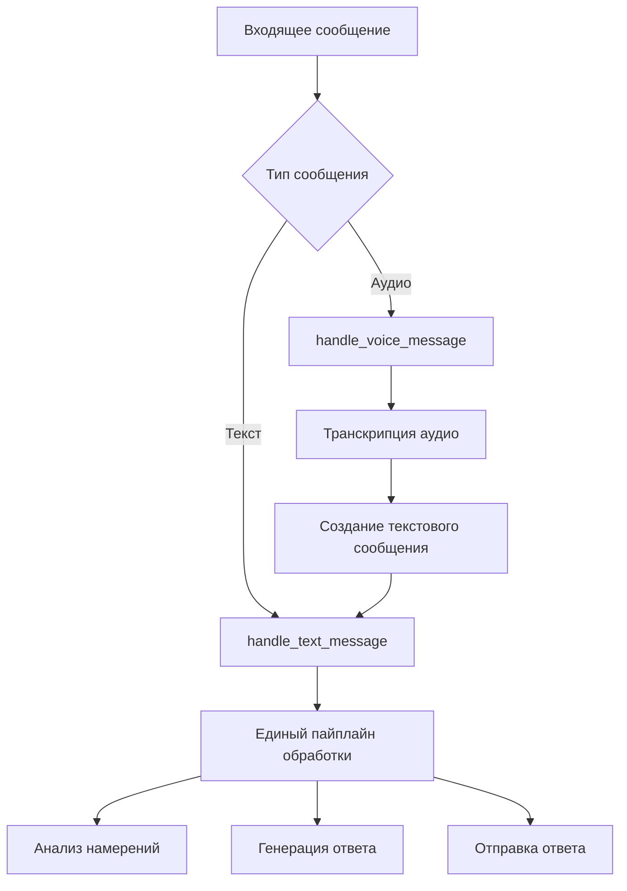

# Унификация пайплайнов обработки сообщений

## Обзор

Данный документ описывает план унификации пайплайнов обработки текстовых и аудиосообщений в Easy Lessons Bot для обеспечения архитектурной согласованности.

## Текущая проблема

### Архитектурная несогласованность

В настоящее время в боте существуют два отдельных пайплайна обработки сообщений:

1. **Текстовый пайплайн** (`bot/handlers.py`):
   ```
   Текстовое сообщение → handle_text_message() → LLM анализ → Генерация ответа
   ```

2. **Медиа-пайплайн** (`bot/media_handlers.py`):
   ```
   Аудиосообщение → handle_voice_message() → Транскрипция → Анализ намерений → Генерация ответа
   ```

### Проблемы текущей архитектуры

1. **Дублирование логики**: Анализ намерений выполняется в обоих пайплайнах
2. **Разные API**: Разные вызовы LLM для анализа и генерации ответов
3. **Несогласованное логирование**: Разные форматы и уровни логирования
4. **Сложность поддержки**: Изменения в логике требуют модификации двух мест
5. **Разные форматы ответов**: Медиа-пайплайн может генерировать ответы в другом формате

## Предлагаемое решение

### Единый пайплайн обработки

Создать единый пайплайн, где транскрибированный текст из аудио передается в основной текстовый пайплайн:

```
Аудиосообщение → Транскрипция → Передача в текстовый пайплайн → Единая обработка
Текстовое сообщение → Прямая передача в текстовый пайплайн → Единая обработка
```

### Архитектурная схема



## Техническая реализация

### 1. Создание единого интерфейса

```python
# core/message_processor.py
class MessageProcessor:
    """Unified message processing pipeline"""
    
    async def process_message(self, message: Message, source: str = "text") -> str:
        """
        Process any type of message through unified pipeline
        
        Args:
            message: Telegram message object
            source: Source type ("text", "audio", "image")
        
        Returns:
            Generated response text
        """
        # Extract text content
        if source == "audio":
            text_content = await self._transcribe_audio(message)
        elif source == "image":
            text_content = await self._extract_text_from_image(message)
        else:
            text_content = message.text
        
        # Process through unified pipeline
        return await self._process_text_content(text_content, message.chat.id)
```

### 2. Модификация обработчиков

#### Обработчик голосовых сообщений

```python
# bot/handlers.py
@router.message(lambda message: message.voice is not None)
async def handle_voice_message(message: Message) -> None:
    """Handle voice messages by transcribing and passing to text pipeline"""
    chat_id = message.chat.id
    logger.info("🎤 VOICE MESSAGE RECEIVED from user %s", chat_id)
    
    try:
        # Transcribe audio
        transcript = await transcribe_voice_message(message)
        
        # Create synthetic text message
        synthetic_message = create_synthetic_text_message(message, transcript)
        
        # Process through unified text pipeline
        response = await handle_text_message(synthetic_message)
        
        # Send response
        await message.answer(response)
        
    except Exception as e:
        logger.error("Error processing voice message: %s", e)
        await message.answer("Извините, произошла ошибка при обработке голосового сообщения.")
```

#### Создание синтетического текстового сообщения

```python
def create_synthetic_text_message(original_message: Message, transcript: str) -> Message:
    """Create synthetic text message from voice message"""
    # Create a copy of the original message
    synthetic = original_message.model_copy()
    
    # Replace voice content with text
    synthetic.voice = None
    synthetic.text = transcript
    synthetic.content_type = "text"
    
    return synthetic
```

### 3. Удаление дублирования

#### Удалить из медиа-пайплайна:
- Анализ намерений аудио
- Генерацию ответов на основе медиа-контекста
- Отдельную логику обработки ошибок

#### Оставить в медиа-пайплайне:
- Транскрипцию аудио
- Извлечение текста из изображений
- Валидацию медиа-файлов

### 4. Единый пайплайн обработки

```python
# core/unified_processor.py
class UnifiedMessageProcessor:
    """Unified processing pipeline for all message types"""
    
    async def process_text_content(self, text: str, chat_id: int) -> str:
        """Process text content through unified pipeline"""
        
        # 1. Load session context
        session = await self.session_manager.get_session(chat_id)
        
        # 2. Analyze intent (single implementation)
        intent_analysis = await self.analyze_intent(text, session)
        
        # 3. Generate response (single implementation)
        response = await self.generate_response(text, intent_analysis, session)
        
        # 4. Update session
        session.add_message("user", text)
        session.add_message("assistant", response)
        await self.session_manager.save_session(session)
        
        return response
```

## Преимущества унификации

### 1. Архитектурная согласованность
- Единый пайплайн для всех типов сообщений
- Консистентное поведение независимо от источника
- Упрощенная архитектура

### 2. Устранение дублирования
- Одна реализация анализа намерений
- Одна логика генерации ответов
- Единое логирование и обработка ошибок

### 3. Упрощение поддержки
- Изменения в одном месте
- Единообразное тестирование
- Проще добавлять новые типы медиа

### 4. Консистентность пользовательского опыта
- Одинаковые ответы на одинаковые вопросы
- Единообразное поведение бота
- Предсказуемые результаты

## План миграции

### Этап 1: Подготовка
- [ ] Создать `UnifiedMessageProcessor`
- [ ] Добавить функцию создания синтетических сообщений
- [ ] Создать тесты для единого пайплайна

### Этап 2: Модификация обработчиков
- [ ] Изменить `handle_voice_message` для использования единого пайплайна
- [ ] Убрать дублирующую логику из медиа-обработчиков
- [ ] Обновить логирование

### Этап 3: Тестирование
- [ ] Протестировать, что аудио и текст дают одинаковые результаты
- [ ] Проверить производительность
- [ ] Убедиться в отсутствии регрессий

### Этап 4: Очистка
- [ ] Удалить неиспользуемый код из медиа-пайплайна
- [ ] Обновить документацию
- [ ] Провести рефакторинг

## Риски и митигация

### Риски
1. **Регрессии**: Изменение поведения существующих функций
2. **Производительность**: Дополнительные вызовы при обработке аудио
3. **Сложность**: Временное усложнение кода во время миграции

### Митигация
1. **Тестирование**: Comprehensive testing before deployment
2. **Постепенная миграция**: Поэтапное внедрение изменений
3. **Мониторинг**: Тщательное отслеживание производительности
4. **Откат**: Возможность быстрого отката к предыдущей версии

## Метрики успеха

### Функциональные метрики
- [ ] Аудио и текст дают идентичные результаты на одинаковые вопросы
- [ ] Время обработки аудио не увеличилось более чем на 10%
- [ ] Все существующие тесты проходят

### Архитектурные метрики
- [ ] Уменьшение дублирования кода на 50%+
- [ ] Единообразное логирование всех типов сообщений
- [ ] Упрощение добавления новых типов медиа

### Пользовательские метрики
- [ ] Отсутствие жалоб на разное поведение для аудио/текста
- [ ] Сохранение или улучшение качества ответов
- [ ] Стабильная производительность

## Заключение

Унификация пайплайнов обработки сообщений является важным архитектурным улучшением, которое обеспечит:

- **Консистентность**: Единообразное поведение для всех типов сообщений
- **Поддерживаемость**: Упрощение разработки и поддержки
- **Расширяемость**: Легкое добавление новых типов медиа
- **Надежность**: Меньше дублирования = меньше багов

Реализация должна проводиться поэтапно с тщательным тестированием на каждом этапе.


