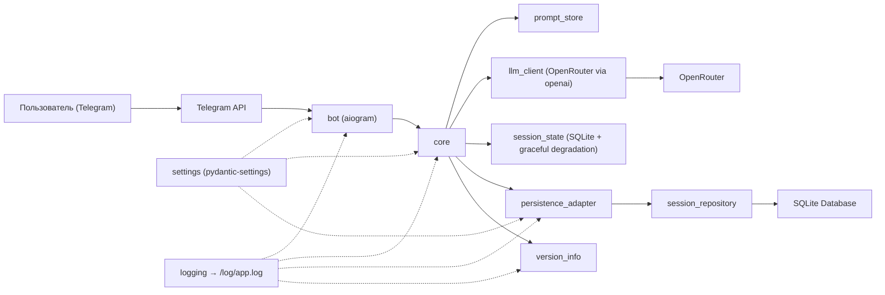
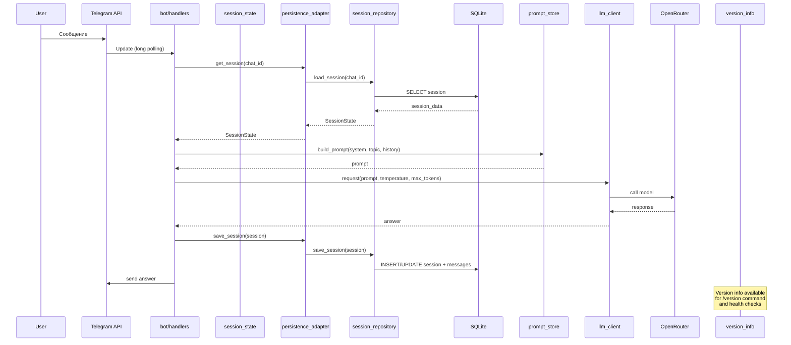
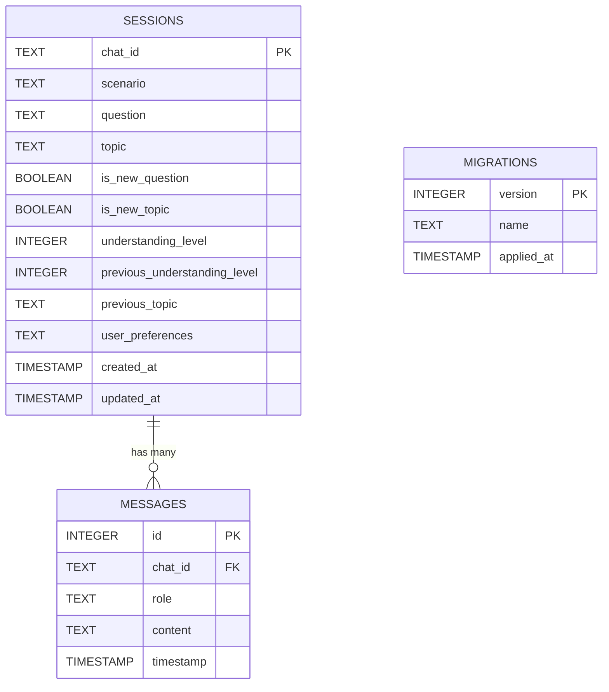
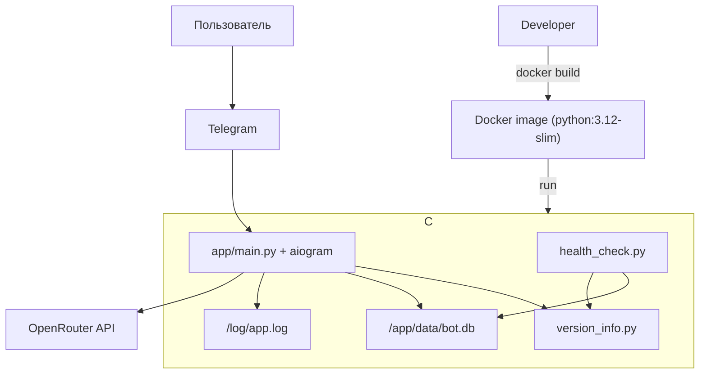

## Техническое видение проекта

### Технологии
- Язык: Python 3.12
- Управление зависимостями и сборка: `uv`, `pyproject.toml`
- Telegram-бот: `aiogram` 3, `asyncio`, режим long polling (MVP)
- Работа с LLM: клиент `openai` с `base_url` OpenRouter; модель по умолчанию — `gpt-4o-mini`
- Данные/состояние: SQLite база данных с SQLAlchemy 2.0 (async/await), graceful degradation в in-memory при недоступности БД (подробности в @persistence.md)
- Конфигурация: переменные окружения + `pydantic-settings`
- Логирование: стандартный `logging` в файл `/log/app.log`, уровень INFO
- Тестирование: `pytest`
- Качество кода: `ruff` (lint + format); `mypy` — отложено
- Автоматизация: `make`
- Деплой: Docker (образ на базе `python:3.12-slim`), non-root, слои с учётом кеша `uv`

### Принципы разработки
- KISS и YAGNI: минимально необходимая сложность
- Тесты: unit-тесты ключевой логики, целевое покрытие 60–70% (MVP)
- Стиль кода: PEP 8; строгая типизация публичных функций; docstring там, где поведение неочевидно
- Комментарии в коде: только на английском языке
- Качество и CI: pre-commit с `ruff` (lint + format) и запуском `pytest`; сборка падает при нарушениях
- Code review: без обязательного ревью в MVP (добавим позже при росте команды)
- Версионирование: semver с автоматическим управлением версиями; релизы по git-тегам с CI/CD

### Структура проекта
- Точка входа: `app/main.py` — инициализация бота, конфигурации и зависимостей
- Каталоги:
  - `bot/` — хэндлеры команд и сообщений, простая маршрутизация; доступ к состоянию
  - `core/` — интеграция с LLM, управление подсказками, простая бизнес-логика
    - `core/llm_client.py` — клиент OpenRouter через `openai`
    - `core/prompt_store.py` — загрузка/выбор шаблонов подсказок
    - `core/session_state.py` — управление состоянием с персистентностью через SQLite
    - `core/context_processor.py` — обработка ответов вспомогательной модели
    - `core/readiness/checker.py` — проверка готовности бота к работе
    - `core/welcome_messages/` — разнообразные приветственные сообщения
    - `core/persistence/` — работа с SQLite, миграции, репозитории
    - `core/prompts/` — проектные промпты и шаблоны
    - `core/version_info.py` — утилиты для получения информации о версии, git commit hash и ветке
  - `settings/` — конфигурация через `pydantic-settings`
  - `tests/` — unit-тесты для `core` и ключевых хэндлеров
  - `scripts/` — утилиты для локальной разработки и вспомогательных задач
    - `scripts/bump_version.py` — автоматическое обновление версии в pyproject.toml
    - `scripts/health_check.py` — health check с информацией о версии
  - `infra/` — инфраструктурные артефакты (напр., docker-compose, CI-конфигурации)
- Файлы верхнего уровня: `pyproject.toml`, `Makefile`, `Dockerfile`, `README.md`
- FSM `aiogram` на этапе MVP не используем: состояние в SQLite с graceful degradation в память
- Слой сервисов на текущем этапе не выделяем; плоские модули в `core/`
- Персистентность: SQLite с автоматическими миграциями, Repository pattern для доступа к данным (архитектура в @persistence.md)
\n+- `Dockerfile` — базовый образ `python:3.12-slim`; установка `uv`; копирование `pyproject.toml` (и `uv.lock`, если появится) и установка зависимостей; затем копирование исходников (`app/`, `bot/`, `core/`, `settings/`); запуск `python -m app.main`; запуск от non-root пользователя
- `Makefile` — основные цели:
  - `install`: установка зависимостей через `uv sync`
  - `lint`: `ruff check .`
  - `fmt`: `ruff format .`
  - `test`: `pytest -q`
  - `run`: локальный запуск `uv run python -m app.main`
  - `docker-build`: `docker build -t easy-lessons-bot:local .`
  - `docker-build-version`: сборка Docker образа с метаданными версии
  - `docker-run`: запуск контейнера с `TELEGRAM_BOT_TOKEN`, `OPENROUTER_API_KEY` в ENV
  - `bump-patch/minor/major`: автоматическое обновление версии
  - `create-tag`: создание git тега для текущей версии
  - `release`: полный цикл релиза (bump + tag + push)

#### Дерево проекта (ASCII)
```
easy-lessons-bot/
├── app/
│   └── main.py
├── bot/
│   ├── handlers.py
│   └── __init__.py
├── core/
│   ├── llm_client.py
│   ├── prompt_store.py
│   ├── session_state.py
│   ├── context_processor.py
│   ├── readiness/
│   │   └── checker.py
│   ├── welcome_messages/
│   │   ├── welcome_01.txt
│   │   ├── welcome_02.txt
│   │   └── ...
│   ├── persistence/
│   │   ├── database.py
│   │   ├── models.py
│   │   ├── repositories.py
│   │   ├── session_adapter.py
│   │   └── migrations/
│   │       ├── manager.py
│   │       └── versions/
│   │           └── 001_initial_schema.py
│   ├── prompts/
│   │   ├── system_base.txt
│   │   ├── scenarios/
│   │   │   ├── system_discussion.txt
│   │   │   ├── system_explanation.txt
│   │   │   └── system_unknown.txt
│   │   └── ...
│   ├── version_info.py
│   └── __init__.py
├── settings/
│   ├── config.py
│   └── __init__.py
├── data/
│   └── bot.db
├── tests/
│   └── ...
├── scripts/
│   ├── bump_version.py
│   ├── health_check.py
│   └── ...
├── infra/
│   └── ...
├── doc/
│   ├── product_idea.md
│   ├── vision.md
│   └── persistence.md
├── pyproject.toml
├── Makefile
├── Dockerfile
└── README.md
```

### Архитектура проекта
- Слои:
  - `bot` — входной слой (`aiogram`), роутинг команд и текста, нормализация входа
  - `core` — сбор контекста, вызовы LLM, обновление состояния
  - `core/persistence` — работа с SQLite, миграции, репозитории
  - `settings` — конфигурация через ENV (`pydantic-settings`)
  - `infra` — Docker/CI и вспомогательные скрипты

- Поток обработки сообщения (двухмодельная архитектура):
  1) Входящее сообщение → `bot/handlers.py` определяет: команда или свободный текст
  2) `core/session_state` читает состояние из БД или создает новое
  3) **Вспомогательная модель** анализирует контекст (5 последних сообщений) и определяет: сценарий, тему, вопрос, уровень понимания
  4) **Context Processor** обрабатывает ответ вспомогательной модели и обновляет состояние сессии
  5) `core/prompt_store` собирает системный промпт: базовый + динамический контекст + промпт сценария
  6) **Диалоговая модель** генерирует ответ на основе обработанного контекста
  7) `core/session_state` обновляет историю и сохраняет в БД
  8) `bot` отправляет ответ пользователю

- Команды и намерения:
  - `/start` — приветствие и краткая инструкция
  - `/version` — информация о версии бота (версия, git commit, ветка, Python версия)
  - «Новая тема» — сброс текущего контекста и установка активной темы
  - Иное — свободный вопрос с объяснением простым языком и обратным уточнением

- Контекст для LLM:
  - системные промпты из `core/prompts/`
  - краткое описание активной темы
  - последние N реплик диалога (ограничение длины)
  - текущая оценка понимания (низкий/средний/высокий) — при наличии

- Надёжность и ошибки:
  - таймаут запроса к LLM, один повтор при сетевых/5xx ошибках
  - user‑friendly сообщение при сбое, логирование метрик латентности и ошибок

- Точки расширения (после MVP):
  - FSM `aiogram` (сценарии), выделение сервисного слоя, мини‑викторины, расширенная оценка понимания, типизированные ответы LLM
  - Расширенная система версионирования: автоматические changelog, интеграция с issue tracker, версионирование API

#### Диаграмма компонентов


#### Диаграмма последовательности


### Модель данных
- Sessions (SQLite, ключ `chat_id`) — детальная схема в @persistence.md:
  - `chat_id`: TEXT PRIMARY KEY — идентификатор чата
  - `scenario`: TEXT — текущий сценарий ("unknown", "discussion", "explanation")
  - `question`: TEXT | null — текущий вопрос
  - `topic`: TEXT | null — активная тема
  - `is_new_question`: BOOLEAN — флаг нового вопроса
  - `is_new_topic`: BOOLEAN — флаг новой темы
  - `understanding_level`: INTEGER (0-9) — уровень понимания
  - `previous_understanding_level`: INTEGER | null — предыдущий уровень
  - `previous_topic`: TEXT | null — предыдущая тема
  - `user_preferences`: TEXT — JSON массив предпочтений
  - `created_at`: TIMESTAMP — время создания
  - `updated_at`: TIMESTAMP — время обновления

- Messages (SQLite, связь с sessions):
  - `id`: INTEGER PRIMARY KEY — автоинкремент
  - `chat_id`: TEXT — ссылка на сессию
  - `role`: TEXT CHECK — "user" или "assistant"
  - `content`: TEXT — содержимое сообщения
  - `timestamp`: TIMESTAMP — время сообщения

- Migrations (SQLite, управление версиями):
  - `version`: INTEGER PRIMARY KEY — номер версии
  - `name`: TEXT — название миграции
  - `applied_at`: TIMESTAMP — время применения

- Topics (динамическое определение):
  - **ВАЖНО**: В системе НЕТ фиксированного списка тем
  - Бот может работать с любой темой, которую предложит пользователь
  - Вспомогательная модель определяет тему на основе контекста диалога
  - Примеры тем (НЕ ограничивающий список): Дроби, Задачи на скорость, Умножение столбиком, Орфограмма ЖИ–ШИ, Фазы Луны, Строение клетки, Безопасность в интернете

- Prompts:
  - **Базовый системный промпт**: `core/prompts/system_base.txt` — базовые принципы работы учителя
  - **Промпты сценариев**: `core/prompts/scenarios/system_<scenario_id>.txt` (discussion, explanation, unknown)
  - **Формирование**: базовый + динамический контекст + промпт сценария (всегда первым сообщением, не обрезается)
  - **Динамический контекст**: scenario, topic, question, understanding_level, previous_understanding_level, previous_topic, user_preferences

- LLM I/O (MVP):
  - вход: собранный текстовый промпт
  - выход: строка ответа; без строгой схемы, типизацию добавим после MVP

#### Диаграмма модели данных


### Работа с LLM
- Клиент: `openai` с `base_url` OpenRouter; модель по умолчанию — `gpt-4o-mini`
- Контекст: до 30 последних сообщений (user/bot) плюс системные подсказки и активная тема
- Параметры по умолчанию: `temperature=0.9`, `max_tokens≈6000`
- Ограничение длины: жёсткий лимит на размер промпта; обрезка истории по длине
- Ретраи: 1 повтор при таймауте и 5xx, экспоненциальная задержка (0.5s → 1.0s)
- Потоковая выдача (stream): выключена в MVP; возвращаем цельный ответ

### Сценарии работы
Бот работает в трех основных сценариях с автоматическим переключением:

#### 1. Сценарий "Обсуждение темы" (discussion)
- **Назначение**: Общее обсуждение и изучение темы
- **Контекст**: тема + уровень понимания (0-9)
- **Примеры**: "Расскажи про математику", "Что такое дроби?", "Как работает электричество?"

#### 2. Сценарий "Разъяснение вопроса" (explanation)  
- **Назначение**: Детальное разъяснение конкретного вопроса или понятия
- **Контекст**: тема + уровень понимания (0-9)
- **Примеры**: "Почему небо голубое?", "Как работает фотосинтез?", "Что такое гравитация?"

#### 3. Сценарий "Неизвестный" (unknown)
- **Назначение**: Свободное общение без закреплённой темы
- **Поведение**: дружелюбная поддержка разговора, мягкие наводки на учебные темы
- **Примеры**: «Привет!», «Поговорим о чём угодно», случайные сообщения

### 9-бальная шкала понимания
- **0-2**: Начальный уровень - простые объяснения, много примеров
- **3-4**: Базовое понимание - структурированные объяснения  
- **5-6**: Хорошее понимание - детальные объяснения с нюансами
- **7-8**: Продвинутый уровень - сложные концепции и связи
- **9**: Экспертный уровень - глубокие дискуссии и анализ

### Деплой
- Образ: один `Dockerfile` на базе `python:3.12-slim` (одностадийная сборка для MVP)
- Установка зависимостей через `uv`; копирование исходников (`app/`, `bot/`, `core/`, `settings/`, `scripts/`)
- Логи: создание директории `/log`; запись логов в `/log/app.log` (эпhemeral внутри контейнера)
- Данные: создание директории `/app/data`; SQLite база в `/app/data/bot.db` (персистентная через volume)
- Запуск от non‑root пользователя; команда запуска: `python -m app.main`
- Версионирование: Docker образы содержат метаданные версии (версия, git commit, дата сборки)
- Health check: встроенный health check с информацией о версии
- Переменные окружения (полный список в @persistence.md):
  - `TELEGRAM_BOT_TOKEN` (required)
  - `OPENROUTER_API_KEY` (required)
  - `OPENROUTER_MODEL` (default: `gpt-4o-mini`)
  - `LLM_TEMPERATURE` (default: `0.9`)
  - `LLM_MAX_TOKENS` (default: `6000`)
  - `HISTORY_LIMIT` (default: `30`)
  - `DATABASE_ENABLED` (default: `true`)
  - `DATABASE_PATH` (default: `data/bot.db`)
  - `DATABASE_CLEANUP_HOURS` (default: `168`)
- Оркестрация: локально `docker-compose`, без Kubernetes в MVP
- Сетевые настройки: long polling, внешние ingress/прокси не требуются

#### Диаграмма деплоя 


### Подход к конфигурированию
- Инструмент: `pydantic-settings`; загрузка из ENV, локально возможен `.env`
- Приоритет: ENV > `.env` > значения по умолчанию
- Обязательные переменные: `TELEGRAM_BOT_TOKEN`, `OPENROUTER_API_KEY`
- Значения по умолчанию: как в разделе «Деплой» (`OPENROUTER_MODEL`, `LLM_TEMPERATURE`, `LLM_MAX_TOKENS`, `HISTORY_LIMIT`, `DATABASE_ENABLED`, `DATABASE_PATH`, `DATABASE_CLEANUP_HOURS`)
- Graceful degradation: при `DATABASE_ENABLED=false` работает только in-memory (принципы в @persistence.md)
- Валидация при старте: при отсутствии обязательных значений — немедленный выход с понятным сообщением об ошибке
- Загрузка конфига один раз при старте процесса; hot‑reload не требуется
- Безопасность: секреты не логируем, в логах скрываем значения токенов
- Размещение: `settings/config.py` с функцией получения singleton‑экземпляра настроек

### Подход к логгированию
- Канал: текстовые логи в файл `/log/app.log` (plain text)
- Формат: `%(asctime)s %(levelname)s %(name)s - %(message)s`
- Уровень по умолчанию: INFO (DEBUG — только локально)
- Содержимое сообщений:
  - для входящих сообщений: `chat_id`, тип (команда/текст)
  - для LLM‑запросов: `duration_ms`, `prompt_tokens?`, `completion_tokens?` (если доступны)
  - для БД операций: инициализация БД, операции с сессиями, миграции
  - для ошибок: трассировка исключений
  - для версионирования: информация о версии при запуске (версия, git commit, ветка, Python версия)
- Ротация/retention: вне приложения (Docker/окружение), в MVP без внутренней ротации
- PII: не логируем чувствительные данные и секреты

### Мониторинг
- Локально: логируем время ответа LLM, количество токенов (если доступно), время операций с БД, количество сессий, размер БД
- Прод: без внешнего APM/мониторинга в MVP; используем логи
- Канал логов: файл `/log/app.log`; ротация и объём — на уровне Docker/окружения
- Корреляция: отдельный request_id не вводим; при необходимости ориентируемся на `chat_id` и время
- Версионирование: health check с информацией о версии; команда `/version` в Telegram для пользователей

### Система версионирования
- **Стандарт**: Semantic Versioning (semver) — MAJOR.MINOR.PATCH
- **Автоматизация**: git hooks для автоматического обновления версий при коммитах
- **CI/CD**: GitHub Actions для создания релизов и тегов
- **Docker**: метаданные версии в образах (версия, git commit, дата сборки)
- **Мониторинг**: информация о версии в логах и health check

#### Компоненты версионирования:
- **`core/version_info.py`** — утилиты для получения информации о версии, git commit hash и ветке
- **`scripts/bump_version.py`** — автоматическое обновление версии в pyproject.toml
- **`scripts/health_check.py`** — health check с информацией о версии
- **Git hooks** — автоматическое обновление версий при коммитах
- **GitHub Actions** — CI/CD с автоматическими релизами

#### Автоматическое версионирование:
- **Patch версия** (0.1.0 → 0.1.1) — автоматически при изменениях в коде
- **Minor версия** (0.1.0 → 0.2.0) — при коммитах с `feat:` или `feature:`
- **Major версия** (0.1.0 → 1.0.0) — при коммитах с `BREAKING CHANGE:` или `!`

#### Команды управления версиями:
- `make bump-patch/minor/major` — ручное обновление версии
- `make create-tag` — создание git тега
- `make release` — полный цикл релиза (bump + tag + push)
- `make docker-build-version` — сборка Docker образа с метаданными

#### Интеграция с пользователями:
- **Команда `/version`** — получение информации о версии бота через Telegram
- **Логи запуска** — отображение версии при старте бота
- **Health check** — информация о версии в мониторинге

