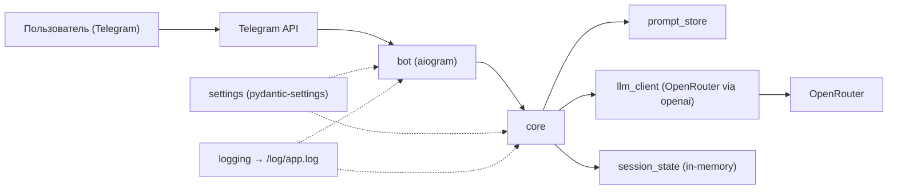
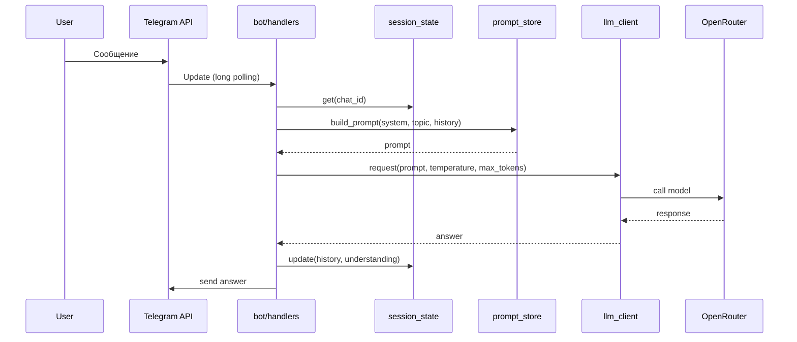
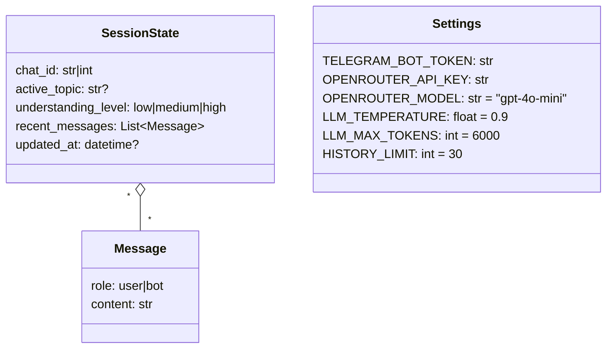
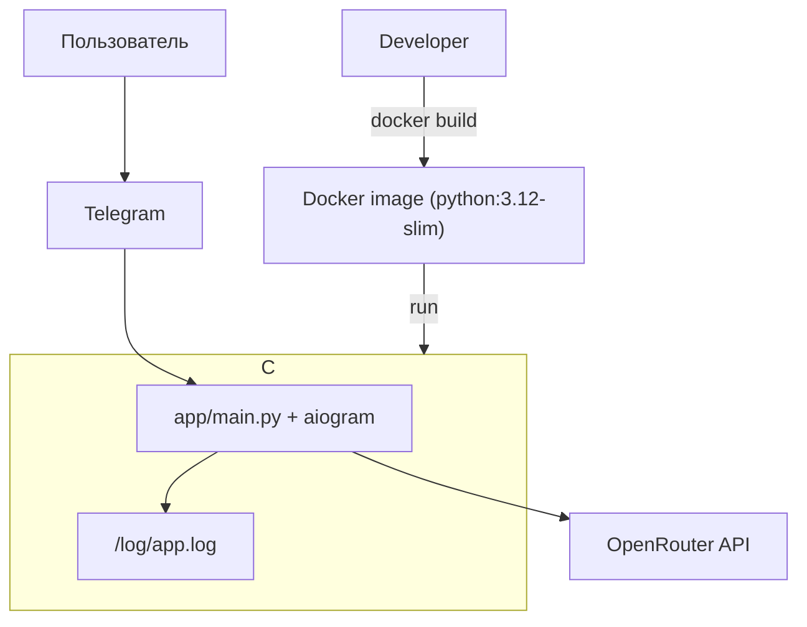

## Техническое видение проекта

### Технологии
- Язык: Python 3.12
- Управление зависимостями и сборка: `uv`, `pyproject.toml`
- Telegram-бот: `aiogram` 3, `asyncio`, режим long polling (MVP)
- Работа с LLM: клиент `openai` с `base_url` OpenRouter; модель по умолчанию — `gpt-4o-mini`
- Данные/состояние: in-memory структуры (`dict`/`list`), без БД
- Конфигурация: переменные окружения + `pydantic-settings`
- Логирование: стандартный `logging` в файл `/log/app.log`, уровень INFO
- Тестирование: `pytest`
- Качество кода: `ruff` (lint + format); `mypy` — отложено
- Автоматизация: `make`
- Деплой: Docker (образ на базе `python:3.12-slim`), non-root, слои с учётом кеша `uv`

### Принципы разработки
- KISS и YAGNI: минимально необходимая сложность
- Тесты: unit-тесты ключевой логики, целевое покрытие 60–70% (MVP)
- Стиль кода: PEP 8; строгая типизация публичных функций; docstring там, где поведение неочевидно
- Комментарии в коде: только на английском языке
- Качество и CI: pre-commit с `ruff` (lint + format) и запуском `pytest`; сборка падает при нарушениях
- Code review: без обязательного ревью в MVP (добавим позже при росте команды)
- Версионирование: semver; релизы по git-тегам — после MVP

### Структура проекта
- Точка входа: `app/main.py` — инициализация бота, конфигурации и зависимостей
- Каталоги:
  - `bot/` — хэндлеры команд и сообщений, простая маршрутизация; доступ к состоянию
  - `core/` — интеграция с LLM, управление подсказками, простая бизнес-логика
    - `core/llm_client.py` — клиент OpenRouter через `openai`
    - `core/prompt_store.py` — загрузка/выбор шаблонов подсказок
    - `core/session_state.py` — in-memory состояние с ключом `chat_id`
    - `core/prompts/` — проектные промпты и шаблоны
  - `settings/` — конфигурация через `pydantic-settings`
  - `tests/` — unit-тесты для `core` и ключевых хэндлеров
  - `scripts/` — утилиты для локальной разработки и вспомогательных задач
  - `infra/` — инфраструктурные артефакты (напр., docker-compose, CI-конфигурации)
- Файлы верхнего уровня: `pyproject.toml`, `Makefile`, `Dockerfile`, `README.md`
- FSM `aiogram` на этапе MVP не используем: простое состояние в памяти (`dict`) по `chat_id`
- Слой сервисов на текущем этапе не выделяем; плоские модули в `core/`
\n+- `Dockerfile` — базовый образ `python:3.12-slim`; установка `uv`; копирование `pyproject.toml` (и `uv.lock`, если появится) и установка зависимостей; затем копирование исходников (`app/`, `bot/`, `core/`, `settings/`); запуск `python -m app.main`; запуск от non-root пользователя
- `Makefile` — основные цели:
  - `install`: установка зависимостей через `uv sync`
  - `lint`: `ruff check .`
  - `fmt`: `ruff format .`
  - `test`: `pytest -q`
  - `run`: локальный запуск `uv run python -m app.main`
  - `docker-build`: `docker build -t easy-lessons-bot:local .`
  - `docker-run`: запуск контейнера с `TELEGRAM_BOT_TOKEN`, `OPENROUTER_API_KEY` в ENV

#### Дерево проекта (ASCII)
```
easy-lessons-bot/
├── app/
│   └── main.py
├── bot/
│   ├── handlers.py
│   └── __init__.py
├── core/
│   ├── llm_client.py
│   ├── prompt_store.py
│   ├── session_state.py
│   ├── prompts/
│   │   └── ...
│   └── __init__.py
├── settings/
│   ├── config.py
│   └── __init__.py
├── tests/
│   └── ...
├── scripts/
│   └── ...
├── infra/
│   └── ...
├── doc/
│   ├── product_idea.md
│   └── vision.md
├── pyproject.toml
├── Makefile
├── Dockerfile
└── README.md
```

### Архитектура проекта
- Слои:
  - `bot` — входной слой (`aiogram`), роутинг команд и текста, нормализация входа
  - `core` — сбор контекста, вызовы LLM, обновление состояния
  - `settings` — конфигурация через ENV (`pydantic-settings`)
  - `infra` — Docker/CI и вспомогательные скрипты

- Поток обработки сообщения:
  1) Входящее сообщение → `bot/handlers.py` определяет: команда или свободный текст
  2) `core/session_state` читает состояние пользователя по `chat_id`
  3) `core/prompt_store` собирает системные подсказки и шаблон под задачу (объяснение/вопрос)
  4) `core/llm_client` вызывает OpenRouter через `openai` и возвращает ответ
  5) `core/session_state` обновляет историю и уровень понимания (простая эвристика; расширим позже)
  6) `bot` отправляет ответ пользователю

- Команды и намерения:
  - `/start` — приветствие и краткая инструкция
  - «Новая тема» — сброс текущего контекста и установка активной темы
  - Иное — свободный вопрос с объяснением простым языком и обратным уточнением

- Контекст для LLM:
  - системные промпты из `core/prompts/`
  - краткое описание активной темы
  - последние N реплик диалога (ограничение длины)
  - текущая оценка понимания (низкий/средний/высокий) — при наличии

- Надёжность и ошибки:
  - таймаут запроса к LLM, один повтор при сетевых/5xx ошибках
  - user‑friendly сообщение при сбое, логирование метрик латентности и ошибок

- Точки расширения (после MVP):
  - FSM `aiogram` (сценарии), выделение сервисного слоя, мини‑викторины, расширенная оценка понимания, типизированные ответы LLM

#### Диаграмма компонентов


#### Диаграмма последовательности


### Модель данных
- SessionState (in‑memory, ключ `chat_id`):
  - `chat_id`: строка/число — идентификатор чата
  - `active_topic`: строка | null — текущая тема (напр., "fractions", "electricity", "caesar")
  - `understanding_level`: one of `low` | `medium` | `high`
  - `recent_messages`: список последних N сообщений вида `{role: "user"|"bot", content: str}`
  - `updated_at`: timestamp — время последнего обновления (опционально)

- Topics (справочник в коде):
  - перечисление/список поддерживаемых тем в `core/prompts/`

- Prompts:
  - системные подсказки в `core/prompts/`
  - пользовательские шаблоны с параметрами: `subject`, `age_hint` (7–11), дополнительные подсказки под стиль объяснений

- LLM I/O (MVP):
  - вход: собранный текстовый промпт
  - выход: строка ответа; без строгой схемы, типизацию добавим после MVP

#### Диаграмма модели данных


### Работа с LLM
- Клиент: `openai` с `base_url` OpenRouter; модель по умолчанию — `gpt-4o-mini`
- Контекст: до 30 последних сообщений (user/bot) плюс системные подсказки и активная тема
- Параметры по умолчанию: `temperature=0.9`, `max_tokens≈6000`
- Ограничение длины: жёсткий лимит на размер промпта; обрезка истории по длине
- Ретраи: 1 повтор при таймауте и 5xx, экспоненциальная задержка (0.5s → 1.0s)
- Потоковая выдача (stream): выключена в MVP; возвращаем цельный ответ

### Сценарии работы
- Старт новой темы:
  - Пользователь вызывает команду «Новая тема»
  - Бот спрашивает название темы и устанавливает `active_topic`
  - Сбрасывается предыдущее состояние (история и уровень понимания)

- Диалог вопрос‑ответ:
  - Пользователь задаёт вопросы в свободной форме по активной теме
  - Бот отвечает простым языком, приводит примеры из жизни и задаёт уточняющие вопросы
  - История ограничивается по длине (до 30 сообщений)

- Завершение темы:
  - По команде пользователя бот подводит краткое резюме ключевых идей
  - Предлагает задать новые вопросы или начать «Новую тему»

### Деплой
- Образ: один `Dockerfile` на базе `python:3.12-slim` (одностадийная сборка для MVP)
- Установка зависимостей через `uv`; копирование исходников (`app/`, `bot/`, `core/`, `settings/`)
- Логи: создание директории `/log`; запись логов в `/log/app.log` (эпhemeral внутри контейнера)
- Запуск от non‑root пользователя; команда запуска: `python -m app.main`
- Переменные окружения:
  - `TELEGRAM_BOT_TOKEN` (required)
  - `OPENROUTER_API_KEY` (required)
  - `OPENROUTER_MODEL` (default: `gpt-4o-mini`)
  - `LLM_TEMPERATURE` (default: `0.9`)
  - `LLM_MAX_TOKENS` (default: `6000`)
  - `HISTORY_LIMIT` (default: `30`)
- Оркестрация: локально `docker-compose`, без Kubernetes в MVP
- Сетевые настройки: long polling, внешние ingress/прокси не требуются

#### Диаграмма деплоя 


### Подход к конфигурированию
- Инструмент: `pydantic-settings`; загрузка из ENV, локально возможен `.env`
- Приоритет: ENV > `.env` > значения по умолчанию
- Обязательные переменные: `TELEGRAM_BOT_TOKEN`, `OPENROUTER_API_KEY`
- Значения по умолчанию: как в разделе «Деплой» (`OPENROUTER_MODEL`, `LLM_TEMPERATURE`, `LLM_MAX_TOKENS`, `HISTORY_LIMIT`)
- Валидация при старте: при отсутствии обязательных значений — немедленный выход с понятным сообщением об ошибке
- Загрузка конфига один раз при старте процесса; hot‑reload не требуется
- Безопасность: секреты не логируем, в логах скрываем значения токенов
- Размещение: `settings/config.py` с функцией получения singleton‑экземпляра настроек

### Подход к логгированию
- Канал: текстовые логи в файл `/log/app.log` (plain text)
- Формат: `%(asctime)s %(levelname)s %(name)s - %(message)s`
- Уровень по умолчанию: INFO (DEBUG — только локально)
- Содержимое сообщений:
  - для входящих сообщений: `chat_id`, тип (команда/текст)
  - для LLM‑запросов: `duration_ms`, `prompt_tokens?`, `completion_tokens?` (если доступны)
  - для ошибок: трассировка исключений
- Ротация/retention: вне приложения (Docker/окружение), в MVP без внутренней ротации
- PII: не логируем чувствительные данные и секреты

### Мониторинг
- Локально: логируем время ответа LLM, количество токенов (если доступно), статусы ошибок
- Прод: без внешнего APM/мониторинга в MVP; используем логи
- Канал логов: файл `/log/app.log`; ротация и объём — на уровне Docker/окружения
- Корреляция: отдельный request_id не вводим; при необходимости ориентируемся на `chat_id` и время

