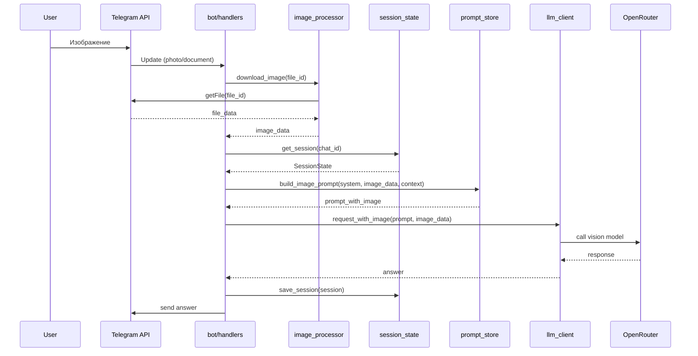

## Техническое видение: Обработка изображений

### Обзор фичи
При добавлении пользователем изображения запускается отдельный сценарий обработки с собственным системным промптом. Данные проходят по стандартному пайплайну с тем же процессом обработки ответов и форматирования.

### Сценарий "Анализ изображения" (image_analysis)
- **Назначение**: Анализ и образовательная работа с изображениями
- **Триггер**: Получение сообщения с типом `photo` или `document` (изображение)
- **Контекст**: изображение + текущая тема (если есть) + уровень понимания (0-9)

### Логика обработки изображений
Системный промпт для анализа изображений реализует следующую логику:

#### 1. Задача на изображении
- **Действие**: Помочь решить задачу, не давая готовый ответ
- **Подход**: Наводящие вопросы, подсказки, чтобы ребенок сам додумался до решения
- **Примеры**: математические задачи, головоломки, упражнения

#### 2. Информация по теме
- **Действие**: Предложить обсудить тему, задать вопросы для закрепления
- **Подход**: Активное вовлечение в изучение материала
- **Примеры**: схемы, диаграммы, иллюстрации к учебным темам

#### 3. Иное содержание
- **Действие**: Начать образовательное обсуждение изображения
- **Подход**: Поиск учебных аспектов в любом изображении
- **Примеры**: фотографии природы, архитектуры, искусства

#### 4. Неподходящий контент
- **Действие**: Вежливо отказаться от обсуждения
- **Условие**: Запрещенный или взрослый контент
- **Результат**: Прекращение диалога с объяснением

### Техническая реализация

#### Новый компонент: Image Processor
- **Файл**: `core/image_processor.py`
- **Функции**:
  - Скачивание изображения из Telegram
  - Подготовка изображения для анализа LLM
  - Определение типа контента (задача/информация/иное/неподходящее)

#### Обновление архитектуры
- **Новый сценарий**: `image_analysis` в `core/session_state.py`
- **Новый промпт**: `core/prompts/scenarios/system_image_analysis.txt`
- **Обработчик**: расширение `bot/handlers.py` для сообщений с изображениями

#### Поток обработки изображения


### Модель данных

#### Обновление Sessions
- **Новое поле**: `last_image_analysis` (TEXT | null) — результат последнего анализа изображения
- **Новое поле**: `image_analysis_count` (INTEGER) — количество проанализированных изображений

#### Новые поля Messages
- **Новое поле**: `has_image` (BOOLEAN) — флаг наличия изображения в сообщении
- **Новое поле**: `image_file_id` (TEXT | null) — ID файла изображения в Telegram

### Системный промпт для анализа изображений

#### Базовый промпт: `core/prompts/scenarios/system_image_analysis.txt`
```
Ты - опытный учитель, который анализирует изображения для образовательных целей.

ПРОАНАЛИЗИРУЙ ИЗОБРАЖЕНИЕ и определи тип контента:

1. ЗАДАЧА НА ИЗОБРАЖЕНИИ:
   - Если видишь математическую задачу, упражнение, головоломку
   - НЕ давай готовый ответ
   - Задавай наводящие вопросы
   - Помогай ребенку самому додуматься до решения
   - Поощряй размышления

2. ИНФОРМАЦИЯ ПО ТЕМЕ:
   - Если видишь схемы, диаграммы, иллюстрации к учебным темам
   - Предложи обсудить эту тему
   - Спроси, есть ли вопросы у ребенка
   - Задавай свои вопросы для закрепления материала
   - Связывай с уже изученными темами

3. ИНОЕ СОДЕРЖАНИЕ:
   - Если изображение не относится к первым двум категориям
   - Найди образовательные аспекты
   - Начни обсуждение с учебной точки зрения
   - Используй изображение как повод для обучения

4. НЕПОДХОДЯЩИЙ КОНТЕНТ:
   - Если изображение содержит запрещенный или взрослый контент
   - Вежливо откажись от обсуждения
   - Объясни, что не можешь помочь с таким контентом
   - Предложи обсудить что-то другое

ВАЖНО:
- Всегда будь дружелюбным и поддерживающим
- Адаптируй сложность под уровень понимания ребенка
- Поощряй самостоятельное мышление
- Используй простой и понятный язык
```

### Работа с LLM для изображений

#### Модель для анализа
- **Модель**: `gpt-4o` (поддержка vision) через OpenRouter
- **Параметры**: `temperature=0.7`, `max_tokens≈4000`
- **Формат**: изображение + текстовый промпт

#### Обработка изображений
- **Скачивание**: через Telegram Bot API `getFile`
- **Размер**: автоматическое сжатие до 1024x1024 пикселей
- **Формат**: JPEG для оптимизации размера
- **Лимиты**: максимум 20MB, таймаут скачивания 30 секунд

### Обработка ошибок

#### Ошибки скачивания
- **Таймаут**: повторная попытка через 5 секунд
- **Большой размер**: сообщение о превышении лимита
- **Неподдерживаемый формат**: предложение отправить другое изображение

#### Ошибки анализа
- **Ошибка LLM**: fallback на текстовый ответ
- **Неподходящий контент**: вежливый отказ
- **Технические сбои**: user-friendly сообщение

### Интеграция с существующей системой

#### Обновление Context Processor
- **Новый тип**: обработка ответов анализа изображений
- **Контекст**: сохранение результатов анализа в сессии
- **Переходы**: возможность перехода к другим сценариям после анализа

#### Обновление Prompt Store
- **Новый метод**: `build_image_prompt()` для сборки промптов с изображениями
- **Контекст**: включение результатов предыдущих анализов
- **Кеширование**: кеш промптов для повторных анализов

### Тестирование

#### Unit-тесты
- **Тестирование**: `tests/test_image_processor.py`
- **Моки**: Telegram API, LLM клиент
- **Покрытие**: скачивание, обработка, анализ изображений

#### Интеграционные тесты
- **Тестирование**: обработка различных типов изображений
- **Сценарии**: задачи, схемы, неподходящий контент
- **Проверка**: корректность ответов и переходов между сценариями

### Развертывание

#### Новые зависимости
- **Pillow**: обработка изображений
- **requests**: скачивание файлов
- **Обновление**: `pyproject.toml` с новыми зависимостями

#### Конфигурация
- **Новые переменные**:
  - `IMAGE_MAX_SIZE_MB` (default: `20`)
  - `IMAGE_DOWNLOAD_TIMEOUT` (default: `30`)
  - `IMAGE_RESIZE_MAX` (default: `1024`)

#### Docker
- **Обновление**: `Dockerfile` с установкой Pillow
- **Размер**: оптимизация образа для работы с изображениями

### Мониторинг

#### Метрики
- **Количество**: проанализированных изображений
- **Время**: скачивания и анализа
- **Ошибки**: скачивания и обработки
- **Типы**: контента (задачи/информация/иное/неподходящее)

#### Логирование
- **События**: скачивание, анализ, ошибки
- **Данные**: размер файла, время обработки, тип контента
- **Безопасность**: не логируем содержимое изображений

### Точки расширения

#### После MVP
- **Поддержка**: видео и аудио файлов
- **Интеграция**: с внешними сервисами анализа изображений
- **Кеширование**: результатов анализа для повторных запросов
- **Аннотации**: возможность добавления текстовых аннотаций к изображениям

#### Дополнительные возможности
- **Генерация**: изображений по описанию
- **Сравнение**: нескольких изображений
- **Поиск**: похожих изображений в базе
- **Экспорт**: результатов анализа в различные форматы
