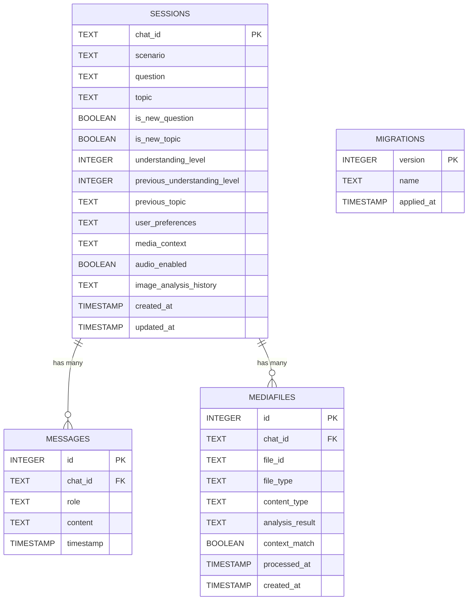
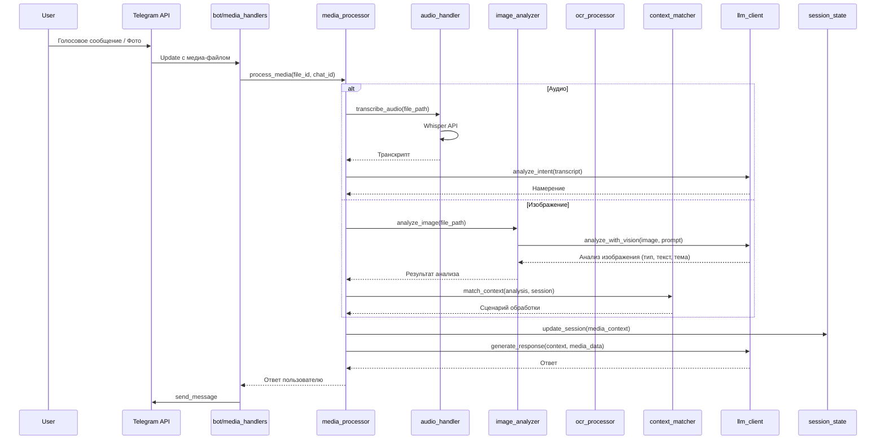

## Техническое видение проекта: Мультимедиа расширения

### Новые технологии
- **Обработка аудио**: `openai-whisper` для распознавания речи, `pyttsx3` или `gTTS` для синтеза речи
- **Обработка изображений**: `PIL` (Pillow) для базовой обработки, `openai` с GPT-4 Vision API для анализа изображений
- **Файловые операции**: стандартные `pathlib` и `tempfile` для работы с файлами
- **Валидация медиа**: `python-magic` для определения типов файлов

### Расширенная архитектура проекта

#### Новые компоненты в `core/`
- `core/media_processor.py` — основной обработчик мультимедиа контента
- `core/audio_handler.py` — обработка голосовых сообщений (распознавание и синтез)
- `core/image_analyzer.py` — анализ изображений через GPT-4 Vision API
- `core/context_matcher.py` — сопоставление медиа-контента с текущим контекстом диалога
- `core/multimedia_prompts/` — специализированные промпты для обработки медиа
  - `audio_analysis.txt` — промпт для анализа аудио контента
  - `image_analysis.txt` — промпт для анализа изображений через Vision API
  - `context_matching.txt` — промпт для сопоставления с контекстом

#### Обновленная структура проекта
```
easy-lessons-bot/
├── app/
│   └── main.py
├── bot/
│   ├── handlers.py
│   ├── media_handlers.py  # Новый: обработка медиа-сообщений
│   └── __init__.py
├── core/
│   ├── llm_client.py
│   ├── prompt_store.py
│   ├── session_state.py
│   ├── context_processor.py
│   ├── media_processor.py      # Новый: координатор медиа-обработки
│   ├── audio_handler.py        # Новый: работа с аудио
│   ├── image_analyzer.py       # Новый: анализ изображений через GPT-4 Vision
│   ├── context_matcher.py      # Новый: сопоставление с контекстом
│   ├── readiness/
│   │   └── checker.py
│   ├── welcome_messages/
│   │   ├── welcome_01.txt
│   │   ├── welcome_02.txt
│   │   └── ...
│   ├── persistence/
│   │   ├── database.py
│   │   ├── models.py
│   │   ├── repositories.py
│   │   ├── session_adapter.py
│   │   └── migrations/
│   │       ├── manager.py
│   │       └── versions/
│   │           ├── 001_initial_schema.py
│   │           └── 002_add_media_support.py  # Новый: поддержка медиа
│   ├── prompts/
│   │   ├── system_base.txt
│   │   ├── scenarios/
│   │   │   ├── system_discussion.txt
│   │   │   ├── system_explanation.txt
│   │   │   └── system_unknown.txt
│   │   ├── multimedia_prompts/  # Новый: промпты для медиа
│   │   │   ├── audio_analysis.txt
│   │   │   ├── image_analysis.txt
│   │   │   └── context_matching.txt
│   │   └── ...
│   ├── version_info.py
│   └── __init__.py
├── settings/
│   ├── config.py
│   └── __init__.py
├── data/
│   ├── bot.db
│   └── temp/                    # Новый: временные медиа-файлы
├── tests/
│   ├── test_media_processor.py  # Новый: тесты медиа-обработки
│   └── ...
├── scripts/
│   ├── bump_version.py
│   ├── health_check.py
│   └── ...
├── infra/
│   └── ...
├── doc/
│   ├── product_idea.md
│   ├── vision.md
│   ├── vision_multimedia.md     # Новый: этот файл
│   └── persistence.md
├── pyproject.toml
├── Makefile
├── Dockerfile
└── README.md
```

### Расширенная модель данных

#### Новые поля в Sessions
- `media_context`: TEXT — JSON с информацией о последних медиа-файлах
- `audio_enabled`: BOOLEAN — предпочтение пользователя по аудио-ответам
- `image_analysis_history`: TEXT — JSON с историей анализа изображений

#### Новая таблица MediaFiles
- `id`: INTEGER PRIMARY KEY — автоинкремент
- `chat_id`: TEXT — ссылка на сессию
- `file_id`: TEXT — Telegram file_id
- `file_type`: TEXT CHECK — "audio", "image", "document"
- `content_type`: TEXT — детальный тип контента (voice, photo, document)
- `analysis_result`: TEXT — JSON с результатами анализа
- `context_match`: BOOLEAN — соответствует ли контексту диалога
- `processed_at`: TIMESTAMP — время обработки
- `created_at`: TIMESTAMP — время создания

#### Диаграмма расширенной модели данных


### Поток обработки медиа-контента

#### Обработка аудио
1. Получение голосового сообщения → `bot/media_handlers.py`
2. Скачивание файла через Telegram API
3. `core/audio_handler.py` → распознавание речи через Whisper
4. Анализ текста через LLM для определения намерения
5. Обработка как обычного текстового сообщения
6. Опционально: синтез ответа в аудио

#### Обработка изображений
1. Получение фото → `bot/media_handlers.py`
2. Скачивание файла через Telegram API
3. `core/image_analyzer.py` → анализ изображения через GPT-4 Vision API:
   - Определение типа контента (текст, задачи, диаграммы, фото)
   - Извлечение и анализ текста на изображении
   - Анализ визуального содержимого и контекста
   - Определение образовательной темы (если применимо)
4. `core/context_matcher.py` → сопоставление с текущим контекстом диалога
5. Выбор сценария обработки:
   - **Контекстный**: продолжение текущего диалога
   - **Объяснение темы**: если обнаружен учебный материал
   - **Решение задач**: если обнаружены задачи
   - **Уточняющий вопрос**: для неопределенного контента
6. Генерация ответа через LLM с учетом типа контента

#### Диаграмма последовательности медиа-обработки


### Сценарии обработки медиа

#### 1. Аудио-сценарии
- **Голосовой вопрос**: распознавание → анализ намерения → текстовый ответ
- **Голосовой ответ**: текстовый ответ → синтез речи → голосовое сообщение
- **Смешанный режим**: пользователь может переключаться между текстом и голосом

#### 2. Изображение-сценарии
- **Контекстное изображение**: анализ связи с текущим диалогом через GPT-4 Vision → продолжение темы
- **Учебный материал**: распознавание темы через Vision API → объяснение простым языком
- **Математические задачи**: извлечение и анализ задач через Vision → пошаговое решение
- **Неопределенный контент**: запрос уточнения у пользователя

#### 3. Комбинированные сценарии
- **Фото + голосовое объяснение**: анализ изображения → голосовой ответ
- **Голосовой вопрос + фото**: анализ обоих → комплексный ответ

### Конфигурация мультимедиа

#### Новые переменные окружения
- `AUDIO_ENABLED`: BOOLEAN (default: `true`) — включение обработки аудио
- `IMAGE_ANALYSIS_ENABLED`: BOOLEAN (default: `true`) — включение анализа изображений
- `WHISPER_MODEL`: TEXT (default: `whisper-1`) — модель Whisper для распознавания
- `TTS_ENABLED`: BOOLEAN (default: `false`) — включение синтеза речи
- `TTS_PROVIDER`: TEXT (default: `gtts`) — провайдер TTS (gtts, pyttsx3)
- `VISION_MODEL`: TEXT (default: `gpt-4o`) — модель для анализа изображений
- `MAX_IMAGE_SIZE`: INTEGER (default: `5242880`) — максимальный размер изображения (5MB)
- `MAX_AUDIO_DURATION`: INTEGER (default: `60`) — максимальная длительность аудио (секунды)
- `TEMP_DIR`: TEXT (default: `data/temp`) — директория для временных файлов

#### Graceful degradation
- При отключенном аудио: медиа-файлы игнорируются с уведомлением
- При недоступности Whisper: fallback на текстовые сообщения
- При ошибках Vision API: fallback на базовое описание изображения
- При превышении лимитов: уведомление о ограничениях

### Производительность и ограничения

#### Оптимизации
- **Кеширование**: результаты анализа изображений кешируются по хешу файла
- **Синхронные файловые операции**: простые и быстрые операции с файлами
- **Очереди**: обработка медиа-файлов в фоновых задачах
- **Сжатие**: автоматическое сжатие изображений перед анализом

#### Ограничения
- **Размер файлов**: максимум 5MB для изображений, 60 секунд для аудио
- **Частота**: не более 10 медиа-файлов в минуту на пользователя
- **Типы файлов**: только поддерживаемые Telegram форматы
- **Языки**: OCR поддерживает русский и английский

### Безопасность и приватность

#### Обработка медиа-файлов
- **Временное хранение**: файлы удаляются после обработки
- **Безопасность**: валидация типов файлов, проверка на вредоносный контент
- **Приватность**: не логируем содержимое медиа-файлов
- **Анонимизация**: удаление метаданных из изображений

#### Контроль доступа
- **Родительский контроль**: настройки для ограничения медиа-функций
- **Возрастные ограничения**: фильтрация неподходящего контента
- **Модерация**: автоматическая проверка на образовательный контент

### Мониторинг мультимедиа

#### Метрики
- **Время обработки**: аудио (распознавание), изображения (анализ через Vision API)
- **Точность**: качество распознавания речи и анализа изображений
- **Использование**: статистика по типам медиа-контента
- **Ошибки**: частота сбоев в обработке медиа

#### Логирование
- **Медиа-операции**: тип файла, размер, время обработки
- **Результаты анализа**: тип контента, качество анализа через Vision API
- **Производительность**: использование ресурсов при обработке

### Деплой с мультимедиа

#### Docker обновления
- **Зависимости**: добавление системных библиотек для обработки медиа (PIL)
- **Временные файлы**: volume для `/app/data/temp`
- **Ресурсы**: стандартные лимиты (Vision API обрабатывается в облаке)

#### Инфраструктура
- **Хранилище**: временное хранилище для медиа-файлов
- **Сеть**: оптимизация для загрузки больших файлов
- **Мониторинг**: отслеживание использования дискового пространства

### Точки расширения

#### Будущие возможности
- **Видео**: анализ коротких видео с извлечением ключевых кадров
- **Документы**: обработка PDF и других документов
- **Интерактивность**: возможность рисования и аннотирования изображений
- **Персонализация**: адаптация под предпочтения пользователя в медиа

#### Интеграции
- **Облачные сервисы**: интеграция с облачными API для обработки медиа
- **Образовательные платформы**: синхронизация с учебными материалами
- **Родительский контроль**: расширенные настройки безопасности

### Тестирование мультимедиа

#### Unit-тесты
- **Медиа-процессор**: тестирование основных функций обработки
- **Аудио-обработчик**: тестирование распознавания речи
- **Анализатор изображений**: тестирование анализа через Vision API
- **Контекстный матчер**: тестирование сопоставления с диалогом

#### Интеграционные тесты
- **End-to-end**: полный цикл обработки медиа-файлов
- **Производительность**: нагрузочное тестирование медиа-обработки
- **Совместимость**: тестирование с различными форматами файлов

#### Тестовые данные
- **Образцы аудио**: различные акценты и качества записи
- **Образцы изображений**: учебные материалы, задачи, диаграммы для тестирования Vision API
- **Edge cases**: нестандартные форматы и поврежденные файлы
